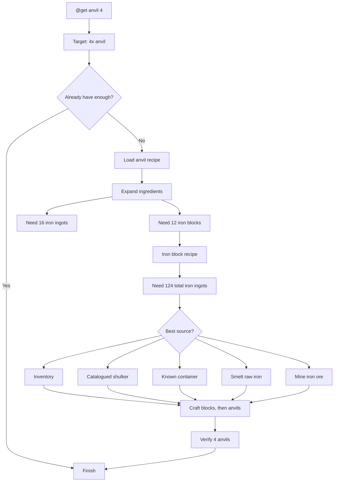
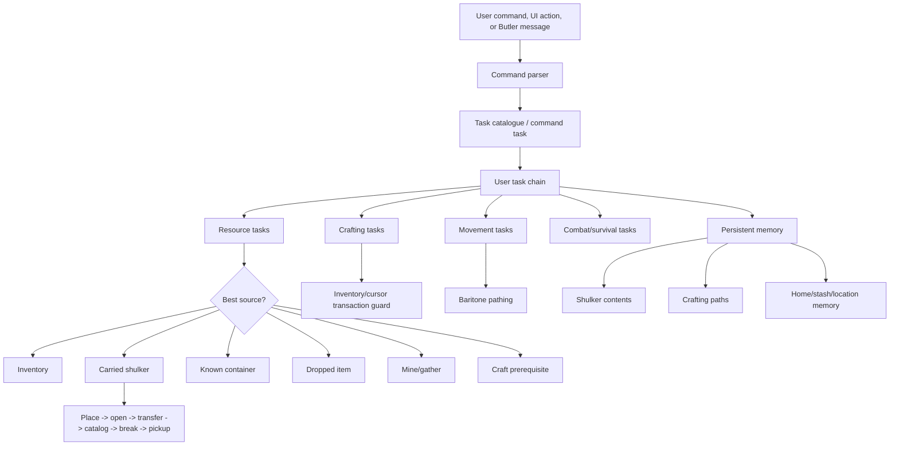

# Belfegor

Belfegor is a Fabric client-side Minecraft automation mod for **Minecraft 1.21.4**. It is a production-focused evolution of Belfegor/Baritone-style task automation with safer crafting, stronger inventory recovery, managed shulker-box sub-inventories, PvP loadout automation, persistent memory, a richer in-game UI, Butler remote control, and detailed debugging for the kinds of Minecraft inventory bugs that usually make bots fall apart.

At its simplest, Belfegor lets you type commands like:

```text
@get diamond_shovel
@toolset iron
@stacked
@shulker store diamond 3
@shulker retrieve stick 8
@player
@build farmland
@home farmland
@ai "what should I do next?"
@craftaudit anvil
```

Behind that small command surface is a task engine that can gather resources, mine, craft, smelt, loot containers, use carried shulkers as storage, path with Baritone, survive hazards, and chain smaller behaviors into larger goals.

## Current release

| Field | Value |
|---|---|
| Minecraft | `1.21.4` |
| Mod version | `1.21.4-beta1` |
| Built jar | [`releases/belfegor-1.21.4-beta1.jar`](releases/belfegor-1.21.4-beta1.jar) |
| Runtime bundle | [`releases/belfegor-1.21.4-beta1-runtime.zip`](releases/belfegor-1.21.4-beta1-runtime.zip) |
| Release notes | [`docs/RELEASE_v1.21.4-beta1.md`](docs/RELEASE_v1.21.4-beta1.md) |
| Jar SHA256 | `99F65E9FDA869DCC55F03D4497B31BB5DF84555817A557FF17DCA3B80C8155E8` |
| Mod id | `belfegor` |
| Command prefix | `@` |
| In-game UI | `C` |
| Global abort key | `+` while a task is running |

The runtime bundle includes the current Belfegor jar, the Fabric API jar from the working `1.21.4` instance, the Baritone API jar from the working instance, release notes, checksums, and documentation.

## What Belfegor is trying to be

Belfegor is not just a macro runner. The long-term goal is an extensible Minecraft agent that can:

- understand high-level goals through commands;
- break those goals into smaller tasks;
- choose between inventory, shulker, container, crafting, mining, smelting, and hunting sources;
- preserve safe inventory state even when interrupted;
- remember useful storage, crafting, and home-base information;
- expose enough logs and UI state that failures are diagnosable;
- eventually automate the catalogue and collection of every craftable item it can obtain.

It is currently beta software, with the most active engineering effort focused on the hard part: **Minecraft inventory correctness**. Cursor state, slot mappings, screen handlers, shulker NBT, and task interruption are the gremlins. Belfegor's task system is built to cage those gremlins rather than pretending they do not exist.

## Feature overview

| Feature | What it means in-game |
|---|---|
| Resource gathering | `@get` can obtain catalogued blocks/items using collection, mining, crafting, smelting, shulkers, and containers. |
| Safer crafting | Inventory and table crafting include cursor recovery, screen diagnostics, and transaction guards. |
| Managed shulkers | Carried shulkers are treated as sub-inventories that can be placed, opened, scanned, used, mined, and picked back up. |
| Auto shulker sorting | Eligible non-tool items can be deposited into shulkers by timer or inventory-fill detection. |
| Offline recipe catalogue | Bundled `1.21.4` recipe data lets Belfegor plan craftable-item dependencies without internet access. |
| Craft audit harness | `@craftaudit` gives normalized leaf resources in a cheat-enabled test world, crafts through the real task system, stores outputs, and logs pass/fail results. |
| PvP prep | `@stacked`, `@toolset`, and `@pvp` automate gear and combat preparation. |
| Player mode | `@player` starts an autonomous explore/gather/craft/home-base loop and grows a remembered modular base. |
| Base expansion | `@build farmland`, `@build storage`, `@build workshop`, and `@build mobfarm` add connected rooms; `@home [room]` navigates to remembered room centers. |
| Local AI advisor | Packaged llama.cpp advisor can use `belfegor/models/Qwen3-1.7B-Q4_K_M.gguf` to answer `@ai` prompts and choose validated next commands during `@player`. |
| Beat-the-game routes | `@gamer` and `@marvion` run classic autonomous completion routes. |
| Butler | Authorized players can command the bot by whisper/private message. |
| UI | Press `C` for task state, commands, settings, shulker memory, and logs. |
| Debug logs | Detailed runtime logs are written to `.minecraft/belfegor/belfegor_debug.log`. |

## Latest tested fixes

The current jar has been tested in the `1.21.4` MultiMC instance against the inventory cases that previously caused client locks:

- `@shulker store [diamond 1, stick 2]` no longer loops on one inventory slot when the slot guard blocks a repeated click.
- `@get diamond_shovel` retrieves a diamond from a catalogued carried shulker, returns leftover cursor items, picks the shulker back up, and then crafts the shovel.
- `@get composter` accepts mixed slab variants in one craft, for example birch slabs plus oak slabs.
- `@get anvil` expands ingots into iron blocks and then crafts the anvil through the guarded crafting table flow.
- managed shulkers now prefer a jump-place-under-player placement path, then open from that known position.
- shulker memory now stores slot-level catalogues: player inventory slot, shulker type, exact 27-slot internal contents, free slots, total count, and a contents fingerprint.
- `@player` writes base memory and spatial awareness snapshots, starts larger modular base construction, records room/module centers and inspections, builds four-high walls, and can grow the camp through connected halls into farmland, storage, workshop, and mob-farm rooms.

See [`docs/TESTING.md`](docs/TESTING.md) for the current manual test matrix and known edge cases.

## Showcase media

- [Showcase video: clean staged in-game demo](docs/media/belfegor-showcase-20260628-v2.mp4)

The current showcase starts from an in-world view, uses visible chat narration, clears inventory/drops, displays Baritone selection help, runs a focused `@craftaudit diamond_shovel`, and shows the resulting safe chest storage.

## What can it do today?

Belfegor can already do a lot of practical survival automation:

- gather logs, stone, ores, food, and many catalogued resources;
- craft tools, workstations, utility items, and equipment;
- run multi-step goals such as `@get diamond_shovel`;
- prepare PvP kits with `@stacked` and `@toolset`;
- path to coordinates and follow players;
- fight or avoid selected mobs through survival/combat chains;
- store/retrieve items from containers;
- use carried shulkers as sub-inventories;
- sort eligible inventory items into shulkers automatically;
- plan normal craftable items from a bundled offline recipe catalogue;
- run developer craft audits with `@craftaudit` to test recipes end-to-end;
- run experimental autonomous play with `@player`;
- ask the Packaged llama.cpp advisor for context-aware help with `@ai`;
- run classic beat-the-game style routines through `@gamer` / `@marvion`;
- let authorized players command the bot by whisper through the Butler system.

## How `@get anvil 4` becomes four anvils

The important idea behind Belfegor is that `@get` is not a macro. It is a goal. When you type:

```text
@get anvil 4
```

Belfegor turns that command into a resource plan:

1. Parse the command as "obtain 4 of `minecraft:anvil`."
2. Check the visible inventory first.
3. Check remembered shulkers and known containers for existing anvils or ingredients.
4. Look up the `anvil` recipe.
5. Expand the recipe into missing ingredients.
6. Gather or craft each missing ingredient.
7. Open the correct crafting interface.
8. Move ingredients through guarded inventory transactions.
9. Craft the output.
10. Verify that the requested count exists in inventory or accessible storage.

For an anvil, the vanilla recipe is:

```text
3 iron blocks
4 iron ingots
```

For four anvils, Belfegor's planner expands that to:

```text
12 iron blocks
16 iron ingots
```

Because each iron block is itself craftable from 9 iron ingots, the dependency tree becomes:

```text
4 anvils
└─ 12 iron blocks + 16 iron ingots
   └─ 108 iron ingots + 16 iron ingots
      └─ 124 total iron ingots
```

Then the bot asks, in order:

- do I already have anvils?
- do I already have iron blocks?
- do I already have iron ingots?
- are any of those inside a catalogued shulker?
- are any in a known container?
- can I smelt raw iron or iron ore?
- can I mine more iron?

If the iron is inside a shulker, the shulker path is part of the same resource plan: place the shulker, ensure it can open, open it, withdraw the required stacks, recatalog contents, close it, mine it, pick it back up, then resume the craft. If the iron must be mined, Belfegor switches into gathering/mining/smelting subtasks and returns to the anvil craft once the prerequisites are satisfied.

This is the same model used for every normal craftable item in Minecraft `1.21.4`: command -> item target -> recipe lookup -> dependency expansion -> source selection -> gather/craft/smelt/retrieve -> guarded crafting -> count verification. The more complete the recipe data and ingredient-tag handling are, the more items can be handled without writing a custom task for each one. Belfegor still has beta edge cases around interchangeable ingredients and unusual server inventories, but the architecture is intentionally recipe-driven rather than hardcoded around one item like a composter or anvil.

The recipe catalogue is bundled in the mod jar as `belfegor_recipes.json`, so basic planning does not require an internet lookup or an external recipe service. The current planner can also expand nested craftable dependencies into leaf resources for testing. For example, an anvil audit resolves iron blocks into iron ingots before it starts the real craft task.



## What can it not do yet?

Belfegor is not a flawless general Minecraft intelligence. Current limitations include:

- the recipe-driven planner is meant to cover every normal craftable `1.21.4` item, but some items still need better ingredient-tag normalization or custom acquisition support;
- recipe variants still need work, especially interchangeable materials such as planks, slabs, stones, dyes, and tags;
- `@player` base building is experimental: it now remembers modular rooms and halls, but aesthetics, obstacle negotiation, and long-range city planning are still evolving;
- shulker identity is based on slot/history/contents fingerprints rather than a perfect unique ID;
- server lag, anti-cheat, protected regions, custom plugins, and unusual inventories can break assumptions;
- beat-the-game routes are world-sensitive and may fail in bad terrain or unlucky structure generation;
- the Java package name still contains legacy `adris.belfegor` paths even though the mod is Belfegor-branded.

## Can Belfegor be used on a server or anarchy server?

Technically, Belfegor is a client-side Fabric mod, so it can run while connected to multiplayer servers if the server and launcher environment allow the required mods. Practically, you should treat this as a rules and trust question:

- On private servers, use it only with owner/admin permission.
- On public servers, check the rules. Automation, pathing bots, combat automation, and remote-control bots are often disallowed.
- On anarchy servers, automation may be culturally expected or tolerated, but there is still no guarantee. Anti-cheat, lag, restarts, queue systems, plugins, and other players can interfere.
- Do not use Butler whitelist-off mode on a public server unless you intentionally want other players to be able to command the bot.
- Belfegor does not promise stealth, bypass, or anti-cheat evasion. It is an automation/research bot, not a ban-evasion tool.

The fun and safe way to use Belfegor is in singleplayer, local test worlds, private SMPs, and bot playground servers where automation is explicitly allowed.

## What is the Butler system?

The Butler system lets other players control Belfegor through whispers/private messages. It watches server/system chat for configured whisper formats, checks authorization, executes the requested command, and whispers progress back to the controlling user.

Example idea:

```text
/msg BotName get diamond 3
/msg BotName follow Steve
/msg BotName shulker retrieve stick 8
```

Important Butler safety notes:

- Authorization uses `belfegor_butler_whitelist.txt` and `belfegor_butler_blacklist.txt`.
- The config lives in `configs/butler.json`.
- `useButlerBlacklist` defaults to `true`.
- `useButlerWhitelist` currently defaults to `false`.
- If whitelist mode is off, the authorization fallback accepts everyone who is not blacklisted.
- For multiplayer use, strongly prefer enabling whitelist mode and adding only trusted usernames.
- Whisper parsing depends on server message format; custom servers may need custom `whisperFormats`.

See [Whitepaper](docs/WHITEPAPER.md) and [Butler and multiplayer guide](docs/BUTLER_AND_SERVERS.md) for the long version.

## Things users should have fun with

Good first experiments:

```text
@get oak_log 16
@get crafting_table
@get stone_pickaxe
@toolset iron
@get diamond_shovel
@shulker store [diamond 3, stick 16]
@shulker retrieve stick 8
@stacked
@player
@build farmland wheat_wing
@home wheat_wing
```

Fun project ideas:

- make a flat creative test world, give the bot starter shulkers, and watch it use them;
- start `@player` and watch it set a home base, build its first camp, then expand it with `@build farmland` or `@build storage`;
- use the `C` UI as a live task debugger while commands run;
- deliberately put recipe supplies in shulkers and confirm `@get` retrieves them;
- build a private “bot ranch” server where friends can command it with Butler;
- run `@stacked` as a stress test for gathering, crafting, and inventory handling.

For developers and cheat-enabled test worlds, `@craftaudit` is the “make the bot prove it” command:

```text
@craftaudit anvil
@craftaudit diamond_shovel
@craftaudit all 25
```

It uses the offline recipe catalogue, computes the leaf resources needed for each target, clears the test inventory between targets, gives only the needed resources/utilities, crafts through the normal Belfegor task engine, stores the result in ordinary containers, and writes a pass/skip/fail log under `.minecraft/belfegor/`. This is intentionally not a normal survival command; it is a regression harness for finding recipe, inventory, shulker, and crafting bugs.

For low-level pathing and construction research, the repo includes a local [Baritone command reference](docs/BARITONE_COMMAND_REFERENCE.md) based on the bundled Baritone jar. Belfegor's campsite system uses Baritone APIs directly for region clearing and generated schematic builds, while `#help`, `#proc`, `#sel`, `#surface`, and related chat commands remain useful for in-game debugging.

## System model



## Install

### 1. Install Minecraft/Fabric prerequisites

You need:

- Minecraft `1.21.4`;
- Fabric Loader `0.16.10` or compatible;
- Fabric API for `1.21.4`;
- the Belfegor jar from this repo.

### 2. Download the jar

For the easiest install, download and extract the runtime bundle:

```text
releases/belfegor-1.21.4-beta1-runtime.zip
```

Then copy the three jars from its `mods/` folder into your instance's `.minecraft/mods/` folder.

If you only want the Belfegor jar, use:

```text
releases/belfegor-1.21.4-beta1.jar
```

The full release asset folder is:

```text
releases/v1.21.4-beta1/
```

### 3. Copy the jar to your instance

For a normal launcher:

```text
.minecraft/mods/belfegor-1.21.4-beta1.jar
```

For MultiMC/Prism Launcher, put it in that instance's `.minecraft/mods` folder.

### 4. Launch once

On first launch, Belfegor creates:

```text
.minecraft/belfegor/
```

Important generated files:

| File | Purpose |
|---|---|
| `belfegor_settings.json` | Main settings. |
| `belfegor_debug.log` | Debug log. |
| `belfegor_shulker_memory.json` | Catalogued shulker contents. |

### 5. Verify in game

Open chat and run:

```text
@help
@status
@get crafting_table
```

Press `C` to open the UI.

## The `C` UI

The Belfegor UI is meant to make the agent inspectable while it works:

| Tab | Purpose |
|---|---|
| Tasks | Active chains, current task, progress/debug state. |
| Macros | Macro runner state. |
| Commands | Full interactive command reference with examples. Double-click examples to run them. |
| Settings | Runtime toggles and configuration visibility. |
| Shulkers | Indexed shulker memory and auto-sort mode. |
| Log | Recent runtime/debug events. |

## Packaged llama.cpp advisor

Belfegor includes an optional local AI advisor inside the mod jar. It calls a bundled llama.cpp `llama-cli` runtime and defaults to this local GGUF model path:

```text
belfegor/models/Qwen3-1.7B-Q4_K_M.gguf
```

When enabled, the advisor exports the live command catalogue, context, prompt, response, and action/reaction log to `.minecraft/belfegor/`.

Use:

```text
@ai "what should I do next?"
```

In `@player`, the advisor can suggest the next Belfegor command, but only if the command exists in the live registry and is not a denied control/developer command. Advisor commands are deferred while a task, inventory screen, cursor stack, or slot click is active, so the model cannot inject work into the middle of a craft/shulker transaction. If llama.cpp is unavailable or the model times out, Belfegor continues with normal deterministic player-mode logic.

## Documentation

- [Whitepaper](docs/WHITEPAPER.md)
- [Architecture](docs/ARCHITECTURE.md)
- [Butler and multiplayer guide](docs/BUTLER_AND_SERVERS.md)
- [Installation guide](docs/INSTALLATION.md)
- [Full command reference](docs/COMMANDS.md)
- [Shulker-box management](docs/SHULKER_MANAGEMENT.md)
- [Beat-the-game, `@player`, and autonomous gameplay](docs/BEAT_THE_GAME.md)
- [Settings and generated files](docs/CONFIGURATION.md)
- [Local llama.cpp LLM advisor](docs/LLM_ADVISOR.md)
- [Troubleshooting](docs/TROUBLESHOOTING.md)
- [Build and development guide](docs/DEVELOPMENT.md)
- [Roadmap](docs/ROADMAP.md)

## Production assets

| Asset | Path |
|---|---|
| Built jar | [`releases/belfegor-1.21.4-beta1.jar`](releases/belfegor-1.21.4-beta1.jar) |
| Mod icon | [`src/main/resources/assets/belfegor/icon.png`](src/main/resources/assets/belfegor/icon.png) |
| Fabric metadata | [`src/main/resources/fabric.mod.json`](src/main/resources/fabric.mod.json) |
| Mixin config | [`src/main/resources/belfegor.mixins.json`](src/main/resources/belfegor.mixins.json) |
| Recipe registry data | [`src/main/resources/belfegor_recipes.json`](src/main/resources/belfegor_recipes.json) |
| Craft audit command | [`src/main/java/adris/Belfegor/commands/CraftAuditCommand.java`](src/main/java/adris/Belfegor/commands/CraftAuditCommand.java) |
| llama.cpp advisor | [`src/main/java/adris/Belfegor/llm/LlmAdvisor.java`](src/main/java/adris/Belfegor/llm/LlmAdvisor.java) |

## Build

Requirements:

- Java 21;
- Gradle wrapper from this repo;
- Minecraft/Fabric dependencies from `gradle.properties`;
- local Baritone API jar at `../baritone/dist/baritone-api.jar` for development builds.

Build:

```powershell
.\gradlew.bat build
```

Output:

```text
build/libs/belfegor-1.21.4-beta1.jar
```

## Project status

Belfegor is actively evolving. Core command execution, item acquisition, crafting, shulker management, PvP preparation, autonomous player mode, and UI inspection are implemented. Expect continued iteration around edge cases, especially container sync and complex inventory states.

## Credits

Belfegor builds on Belfegor-style Minecraft automation ideas and Baritone pathing, with additional Belfegor-specific work around Minecraft `1.21.4`, managed shulkers, UI, crafting stability, PvP tooling, autonomous player mode, memory, and debugging.

## License

SDUC. See [LICENSE](LICENSE).
