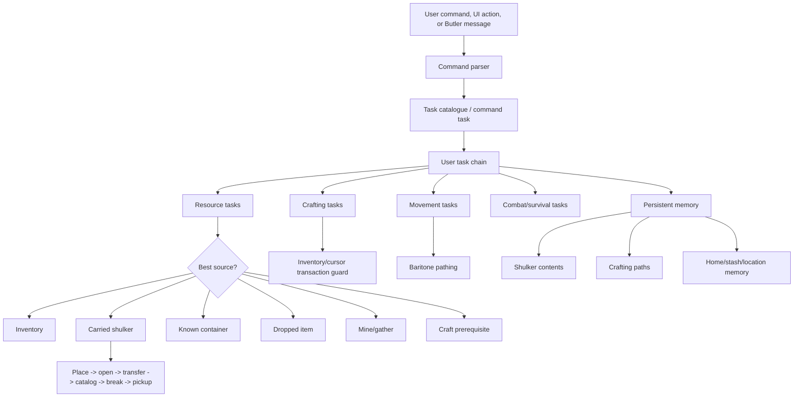
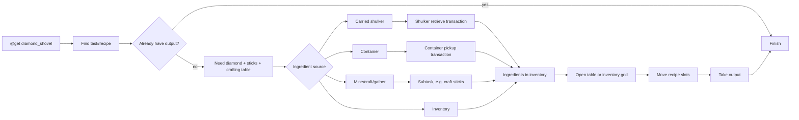

# Belfegor

Belfegor is a Fabric client-side Minecraft automation mod for **Minecraft 1.21.4**. It is a production-focused evolution of AltoClef/Baritone-style task automation with safer crafting, stronger inventory recovery, managed shulker-box sub-inventories, PvP loadout automation, persistent memory, a richer in-game UI, and detailed debugging for the kinds of Minecraft inventory bugs that usually make bots fall apart.

At its simplest, Belfegor lets you type commands like:

```text
@get diamond_shovel
@toolset iron
@stacked
@shulker store diamond 3
@shulker retrieve stick 8
@player
```

Behind that small command surface is a task engine that can gather resources, mine, craft, smelt, loot containers, use carried shulkers as storage, path with Baritone, survive hazards, and chain smaller behaviors into larger goals.

## Current release

| Field | Value |
|---|---|
| Minecraft | `1.21.4` |
| Mod version | `1.21.4-beta1` |
| Built jar | [`releases/belfegor-1.21.4-beta1.jar`](releases/belfegor-1.21.4-beta1.jar) |
| Jar SHA256 | `C3B24C02E960F059686D1B779B998F6680413945424A153BF97684DD775D85F1` |
| Mod id | `belfegor` |
| Command prefix | `@` |
| In-game UI | `C` |
| Global abort key | `+` while a task is running |

## What Belfegor is trying to be

Belfegor is not just a macro runner. The long-term goal is an extensible Minecraft agent that can:

- understand high-level goals through commands;
- break those goals into smaller tasks;
- choose between inventory, shulker, container, crafting, mining, smelting, and hunting sources;
- preserve safe inventory state even when interrupted;
- remember useful storage and crafting information;
- expose enough logs and UI state that failures are diagnosable;
- eventually learn better routes through repeated play.

It is currently beta software, with the most active engineering effort focused on the hard part: **Minecraft inventory correctness**. Cursor state, slot mappings, screen handlers, shulker NBT, and task interruption are the gremlins. Belfegor’s task system is built to cage those gremlins rather than pretending they do not exist.

## Feature overview

| Feature | What it means in-game |
|---|---|
| Resource gathering | `@get` can obtain catalogued blocks/items using collection, mining, crafting, smelting, and containers. |
| Safer crafting | Inventory and table crafting include cursor recovery, screen diagnostics, and transaction guards. |
| Managed shulkers | Carried shulkers are treated as sub-inventories that can be placed, opened, scanned, used, mined, and picked back up. |
| Auto shulker sorting | Eligible non-tool items can be deposited into shulkers by timer or inventory-fill detection. |
| PvP prep | `@stacked`, `@toolset`, and `@pvp` automate gear and combat preparation. |
| Player mode | `@player` starts an autonomous explore/gather/craft/home-base loop. |
| UI | Press `C` for task state, commands, settings, shulker memory, and logs. |
| Debug logs | Detailed runtime logs are written to `.minecraft/belfegor/belfegor_debug.log`. |

## System model



## How `@get diamond_shovel` works

A command like `@get diamond_shovel` becomes a small planning problem:



The important detail is that shulker/container/crafting interactions are treated as transactions. A competing task should not interrupt a half-finished click sequence and strand an item on the cursor.

## Install

### 1. Install Minecraft/Fabric prerequisites

You need:

- Minecraft `1.21.4`;
- Fabric Loader `0.16.10` or compatible;
- Fabric API for `1.21.4`;
- the Belfegor jar from this repo.

### 2. Download the jar

Use:

```text
releases/belfegor-1.21.4-beta1.jar
```

### 3. Copy the jar to your instance

For a normal launcher:

```text
.minecraft/mods/belfegor-1.21.4-beta1.jar
```

For MultiMC/Prism Launcher, put it in that instance’s `.minecraft/mods` folder.

### 4. Launch once

On first launch, Belfegor creates:

```text
.minecraft/belfegor/
```

Important generated files:

| File | Purpose |
|---|---|
| `belfegor_settings.json` | Main settings. |
| `belfegor_debug.log` | Debug log. |
| `belfegor_shulker_memory.json` | Catalogued shulker contents. |

### 5. Verify in game

Open chat and run:

```text
@help
@status
@get crafting_table
```

Press `C` to open the UI.

## Quick start examples

```text
@help
@help shulker
@list
@get oak_log 16
@get crafting_table
@get diamond_shovel
@toolset iron
@stacked
@shulker list
@shulker store diamond 3
@shulker retrieve stick 8
@shulker auto on
@shulker auto detection
@player
@stop
```

## The `C` UI

The Belfegor UI is meant to make the agent inspectable while it works:

| Tab | Purpose |
|---|---|
| Tasks | Active chains, current task, progress/debug state. |
| Macros | Macro runner state. |
| Commands | Full interactive command reference with examples. Double-click examples to run them. |
| Settings | Runtime toggles and configuration visibility. |
| Shulkers | Indexed shulker memory and auto-sort mode. |
| Log | Recent runtime/debug events. |

## Documentation

- [Architecture](docs/ARCHITECTURE.md)
- [Installation guide](docs/INSTALLATION.md)
- [Full command reference](docs/COMMANDS.md)
- [Shulker-box management](docs/SHULKER_MANAGEMENT.md)
- [Beat-the-game and autonomous gameplay](docs/BEAT_THE_GAME.md)
- [Settings and generated files](docs/CONFIGURATION.md)
- [Troubleshooting](docs/TROUBLESHOOTING.md)
- [Build and development guide](docs/DEVELOPMENT.md)
- [Roadmap](docs/ROADMAP.md)

## Production assets

| Asset | Path |
|---|---|
| Built jar | [`releases/belfegor-1.21.4-beta1.jar`](releases/belfegor-1.21.4-beta1.jar) |
| Mod icon | [`src/main/resources/assets/belfegor/icon.png`](src/main/resources/assets/belfegor/icon.png) |
| Fabric metadata | [`src/main/resources/fabric.mod.json`](src/main/resources/fabric.mod.json) |
| Mixin config | [`src/main/resources/belfegor.mixins.json`](src/main/resources/belfegor.mixins.json) |
| Recipe registry data | [`src/main/resources/belfegor_recipes.json`](src/main/resources/belfegor_recipes.json) |

## Build

Requirements:

- Java 21;
- Gradle wrapper from this repo;
- Minecraft/Fabric dependencies from `gradle.properties`;
- local Baritone API jar at `../baritone/dist/baritone-api.jar` for development builds.

Build:

```powershell
.\gradlew.bat build
```

Output:

```text
build/libs/belfegor-1.21.4-beta1.jar
```

## Project status

Belfegor is actively evolving. Core command execution, item acquisition, crafting, shulker management, PvP preparation, autonomous player mode, and UI inspection are implemented. Expect continued iteration around edge cases, especially container sync and complex inventory states.

## Credits

Belfegor builds on AltoClef-style Minecraft automation ideas and Baritone pathing, with additional Belfegor-specific work around Minecraft `1.21.4`, managed shulkers, UI, crafting stability, PvP tooling, autonomous player mode, memory, and debugging.

## License

MIT. See [LICENSE](LICENSE).
