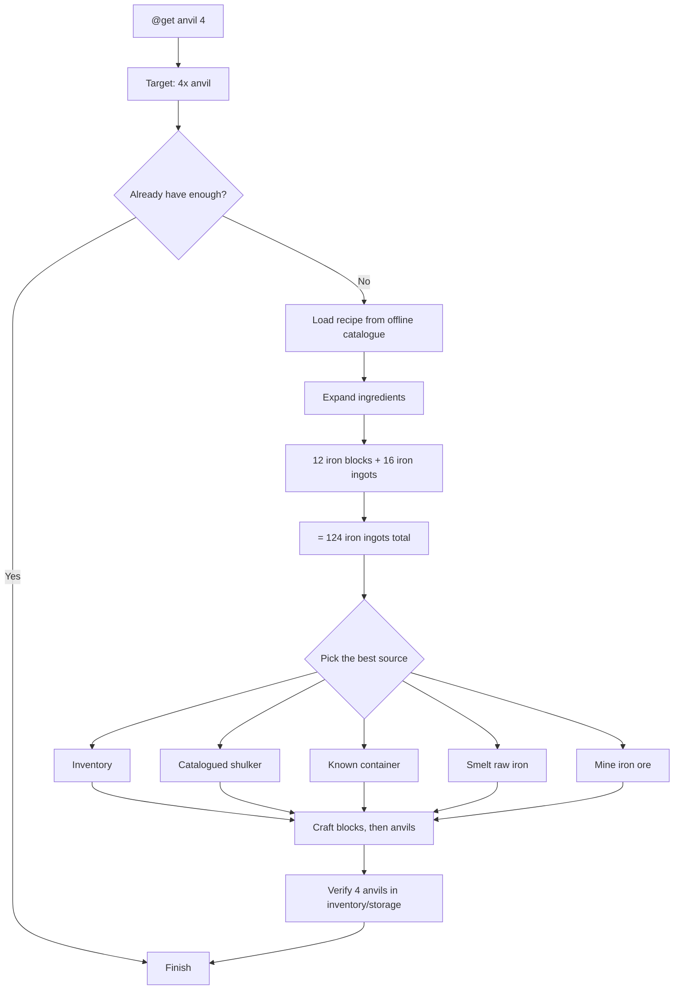
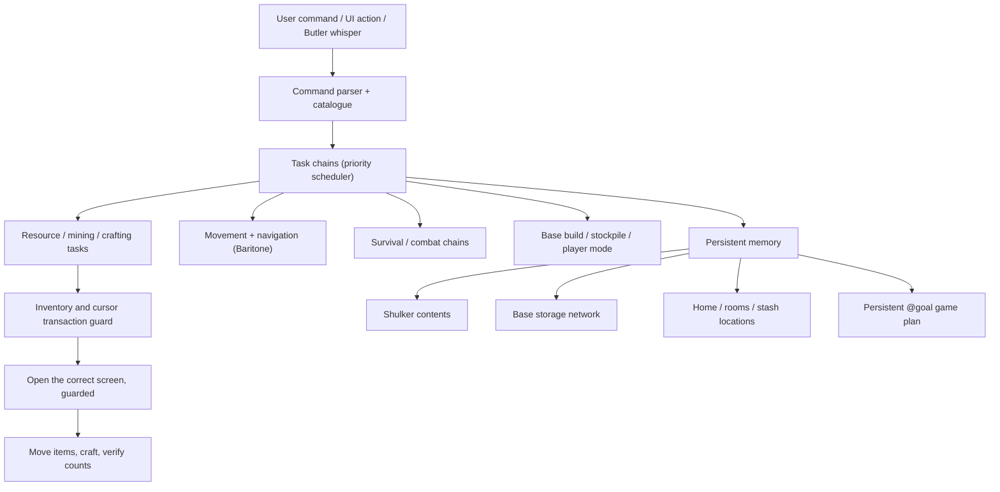

# Belfegor


**A production-minded Minecraft automation agent for Fabric 1.21.4.**

Belfegor turns one command like `@get diamond_shovel` into a real plan: check
inventory, catalogued shulkers and known chests, expand the recipe into
ingredients, mine, smelt, craft through guarded inventory transactions, and
verify the result.

> **Status:** beta - actively developed. The hard engineering focus is
> **Minecraft inventory correctness**: cursor state, slot mappings, screen
> handlers, shulker NBT, and task interruption.

| | |
|---|---|
| Minecraft | 1.21.4 - Fabric Loader 0.16.10+ - Java 21 |
| Mod version | `1.21.4-beta1` |
| Latest jar | [`releases/belfegor-1.21.4-beta1.jar`](releases/belfegor-1.21.4-beta1.jar) |
| Runtime bundle | [`releases/belfegor-1.21.4-beta1-runtime.zip`](releases/belfegor-1.21.4-beta1-runtime.zip) |
| Release notes | [`docs/RELEASE_v1.21.4-beta1.md`](docs/RELEASE_v1.21.4-beta1.md) |
| Jar SHA256 | `5871c64b95ffc7fbb3ad46692ba2d87164e57453d555735121973871b950371a` |
| Runtime bundle SHA256 | `09e6f402dcf0643b86f308ee62af97eee5d45eadbfc919eb82f2e9eb8349cffb` |

The repo keeps immutable jar copies under [`releases/jars/`](releases/jars/) so
the previous public jar can be compared with the current one. The current jar is `belfegor-1.21.4-beta1-cca94f6.jar`; the previous public jar is `belfegor-1.21.4-beta1-341eae3.jar`. Fall-clutch configuration is documented
in [`docs/MLG_CLUTCHES.md`](docs/MLG_CLUTCHES.md).

---

## Contents

- [What it does](#what-it-does)
- [Quick start](#quick-start)
- [Commands at a glance](#commands-at-a-glance)
- [How the system works](#how-the-system-works)
- [Features](#features)
- [Persistent memory](#persistent-memory)
- [The AI advisor](#the-ai-advisor)
- [The in-game UI](#the-in-game-ui)
- [MLG fall clutches](#mlg-fall-clutches)
- [See it in action](#see-it-in-action)
- [Limitations and servers](#limitations-and-servers)
- [Documentation](#documentation)
- [Building from source](#building-from-source)
- [Project status](#project-status)

---

## What it does

Type a command in chat and the bot does the work:

```text
@get diamond_shovel      # gather + craft a full recipe chain
@toolset iron            # full iron tool set
@armor iron              # full iron armor, equipped
@equipment diamond       # full tools + armor for a material
@stockpile stone starter # gather camp supplies, deposit at home
@player                  # autonomous explore/gather/build loop
@pillar 12               # pillar up (breaks overhead blocks underground)
@ai "what should I do next?"
```

Behind that surface is a **task engine** that chooses between inventory,
shulkers, containers, dropped items, mining, smelting, and crafting; a
**persistent memory** of storage, bases, recipes, and goals; and a **guarded
inventory layer** that recovers cursors, validates screens, and keeps
transactions from corrupting the inventory.

## Quick start

1. **Install the mod.** Copy the three jars from `releases/v1.21.4-beta1/mods/`
   (Belfegor, Fabric API, Baritone API) into your instance's
   `.minecraft/mods/` folder - or just extract the runtime zip.
2. **Launch once.** Belfegor creates `.minecraft/belfegor/` with settings,
   logs, and memory files on first run.
3. **Verify in game.** Run:

   ```text
   @help
   @status
   @get crafting_table
   ```

   Press `C` (or run `@ui`) to open the control panel.

Full install details: [`docs/INSTALLATION.md`](docs/INSTALLATION.md).
Settings and generated files: [`docs/CONFIGURATION.md`](docs/CONFIGURATION.md).

## Commands at a glance

| Category | Commands |
|---|---|
| Resources | `@get <item> [count]`, `@mine <ore> [count]`, `@hunt <mob> [count]`, `@food`, `@meat` |
| Tools and gear | `@toolset <tier>`, `@armor <material>`, `@equipment <material>`, `@equip [armors]`, `@stacked` |
| Base and home | `@camp`, `@build <room>/full/validate/repair`, `@home [room]`, `@stockpile`, `@drop home` |
| Storage | `@store`, `@retrieve`, `@deposit`, `@stash`, `@shulker <action>` |
| Movement | `@goto <xyz>`, `@follow <player>`, `@forward/@back/@left/@right <blocks>`, `@face <dir>`, `@turn <dir>`, `@pillar <height>` |
| Autonomy | `@player`, `@goal [next/start/stop]`, `@gamer`, `@marvion` |
| Intelligence | `@ai "question"` |
| Control | `@status`, `@coords`, `@inventory`, `@list`, `@stop` (`+` aborts), `@reload_settings` |
| Development | `@craftaudit <target>`, `@baritone <cmd>` |

The full reference with usage, arguments, and examples is in
[`docs/COMMANDS.md`](docs/COMMANDS.md) - the same registry powers `@help`, the
Commands tab, and the AI advisor.

## How the system works

One command becomes a goal, and a goal becomes a task tree:


```mermaid
flowchart TD
    Cmd["@get anvil 4"] --> Target["Target: 4x anvil"]
    Target --> Have{"Already have enough?"}
    Have -- Yes --> Done["Finish"]
    Have -- No --> Recipe["Load recipe from offline catalogue"]
    Recipe --> Expand["Expand ingredients"]
    Expand --> IronB["12 iron blocks + 16 iron ingots"]
    IronB --> IronI["= 124 iron ingots total"]
    IronI --> Sources{"Pick the best source"}
    Sources --> Inv["Inventory"]
    Sources --> Shulker["Catalogued shulker"]
    Sources --> Container["Known container"]
    Sources --> Smelt["Smelt raw iron"]
    Sources --> Mine["Mine iron ore"]
    Inv --> Craft["Craft blocks, then anvils"]
    Shulker --> Craft
    Container --> Craft
    Smelt --> Craft
    Mine --> Craft
    Craft --> Verify["Verify 4 anvils in inventory/storage"]
    Verify --> Done
```

The engine that executes that tree:


```mermaid
flowchart TD
    Input["User command / UI action / Butler whisper"] --> Parser["Command parser + catalogue"]
    Parser --> Chain["Task chains (priority scheduler)"]
    Chain --> Resource["Resource / mining / crafting tasks"]
    Chain --> Move["Movement + navigation (Baritone)"]
    Chain --> Combat["Survival / combat chains"]
    Chain --> Base["Base build / stockpile / player mode"]
    Resource --> Guard["Inventory and cursor transaction guard"]
    Guard --> Screen["Open the correct screen, guarded"]
    Screen --> Txn["Move items, craft, verify counts"]
    Chain --> Memory["Persistent memory"]
    Memory --> ShulkerMem["Shulker contents"]
    Memory --> StorageMem["Base storage network"]
    Memory --> LocationMem["Home / rooms / stash locations"]
    Memory --> GoalMem["Persistent @goal game plan"]
```

A few details worth knowing:

- **Tasks are composable and resumable.** A resource task returns a child
  task; when the child finishes, the parent advances. Base construction
  persists its phase per base, so `@camp`/`@build` resume after interruption
  instead of restarting.
- **Inventory correctness is enforced.** Cursor recovery, screen-open
  diagnostics, slot-click guards, and forced-continuation during active
  transactions keep the inventory from being corrupted mid-craft.
- **Chains set priorities.** Food, mob defense, MLG falls, and tool
  requirements run as background chains; user tasks own the lane at
  priority 50. Chain-interrupt history makes oscillations visible in
  `@status history` and the Tasks tab.
- **Sources are chosen, not assumed.** Before gathering, the planner checks
  inventory, catalogued shulkers, remembered chests, dropped items, and
  storage-at-base.
- **Nearby fixtures win.** Crafting tables, furnaces, and chests already in
  the world (within six blocks) are used instead of crafting and placing new
  ones.
- **Tools are maintained.** Wood gathering forces an axe at the current tool
  tier, tool sets upgrade as whole sets, and `@player` keeps a backup set
  stored at base.

See [`docs/ARCHITECTURE.md`](docs/ARCHITECTURE.md) and
[`docs/WHITEPAPER.md`](docs/WHITEPAPER.md) for the long versions.

## Features

| Area | What it means in-game |
|---|---|
| Recipe-driven `@get` | Every normal craftable item in 1.21.4 is planned from a bundled offline recipe catalogue, expanded into ingredients, and sourced from the best available place. |
| Food variety | `@food`/`@meat` gather whatever is nearby: pork, beef, chicken, mutton, rabbit, fish, wheat/carrot/potato/beetroot crops, hay/bread, and sweet berries, cooking meat and baking potatoes as needed. |
| Safe crafting | 2x2 inventory and 3x3 table crafting with cursor recovery, screen diagnostics, and transaction guards - including the `CRAFT-SCREEN-STORM` protection. |
| Managed shulkers | Carried shulkers are treated as sub-inventories: placed, opened, scanned, transferred into, recatalogued, mined, and picked back up. |
| Shulker auto-sort | Eligible non-tool items deposit into shulkers by timer or inventory-fill detection. |
| Base storage economy | Chests are remembered as a storage network with persisted counts; stockpile, triage, and stash flows update the ledger. |
| Autonomous player mode | `@player` explores, gathers, builds a remembered modular base, expands rooms, maintains tools, and resumes the persistent `@goal` game plan. |
| Base building | `@build full` builds/repairs/validates the complete modular base; rooms are footprint-aware, home is locked, and validation uses the saved blueprint. |
| Schematic import | `@build base import "file"` accepts `.litematic`, `.schematic`, `.schem`, and `.json` files, sources every required block material in game, stages it in a chest at the build site, and builds the full structure. |
| PvP and loadouts | `@toolset`, `@armor`, `@equipment`, and `@stacked` prepare full gear; `@pvp` runs the combat loop. |
| MLG fall clutches | Auto-MLG supports water, powder snow, slime, honey, hay, scaffolding, cobweb, ladders, vines, sweet berry bushes, totems, ender pearls, and all bed colors. |
| Local AI advisor | Optional packaged llama.cpp advisor answers `@ai` and can suggest the next validated command in `@player`. |
| UI | `C` / `@ui` opens a control panel: tasks, commands, macros, settings, shulkers, schematics, and logs. |
| Butler | Authorized players can command the bot by whisper/private message. |
| Audits | `@craftaudit all` proved 799/799 craftable targets; `@craftaudit screens` proved all handled screens open/close cleanly. |

## Persistent memory

Belfegor persists what matters so it does not rediscover the world every run
(in `.minecraft/belfegor/`):

| File | What it remembers |
|---|---|
| `belfegor_bases.json` | Home/base records, rooms, modules, doorway, blueprint path. |
| `belfegor_base_storage.json` | Known counts in the base storage network. |
| `belfegor_shulker_memory.json` | Slot-level shulker catalogues and fingerprints. |
| `belfegor_locations.json` | Remembered crafting tables, containers, stashes, doors. |
| `belfegor_gameplan.json` | The persistent `@goal` stage-by-stage game plan. |
| `belfegor_errands.json` | Gathered-and-stashed supplies the bot can withdraw later. |
| `belfegor_crafting_paths.json` | Successful recipe routes for faster planning later. |

## The AI advisor

Belfegor ships an optional local llama.cpp advisor (no cloud). When enabled
and given a model, `@ai "what should I do next?"` prints a chat response plus
a parsed command and reason. The advisor sees the live task status, the
command catalogue (exported as MCP-style JSON), inventory/shulker memory, the
current goal, and the action log. In `@player` it can suggest the next
validated command - deferred while a task, screen, or slot click is active.

See [`docs/LLM_ADVISOR.md`](docs/LLM_ADVISOR.md).

## The in-game UI

Press `C` or run `@ui`:

| Tab | Purpose |
|---|---|
| Tasks | Active chains, current task, debug state, interrupt history. |
| Commands | Interactive command reference - double-click examples to run them. |
| Macros | Create/edit/reorder/run/pause/stop macro command lists. |
| Settings | Runtime toggles. |
| Shulkers | Indexed shulker memory and auto-sort mode. |
| Log | Recent runtime events. |

## MLG fall clutches

The auto-MLG system places the configured clutch item correctly for each item
type - fluids into the fall column, blocks onto the landing block, beds with
an empty head cell, ladders/vines grabbed and climbed, totems in the offhand,
pearls thrown just before impact - verifies the placement, and never stacks
blocks. Configuration lives in `belfegor/configs/mlg_clutch_settings.json`.
See [`docs/MLG_CLUTCHES.md`](docs/MLG_CLUTCHES.md).

## See it in action

- [Showcase video: staged in-game demo](docs/media/belfegor-showcase-20260628-v2.mp4)
- [Audit proof recordings: full craft + screen audits](docs/media/audit-proof-2026-07-02/README.md)

## Limitations and servers

Belfegor is beta automation, not general Minecraft intelligence. Known limits:

- Recipe planning covers normal craftable 1.21.4 items, but some
  interchangeable-ingredient and tag variants still need work.
- `@player` base building is functional but aesthetics and long-range city
  planning are still evolving.
- Server lag, plugins, protected regions, anti-cheat, and unusual inventories
  can break assumptions; the bot does not promise stealth or bypass.
- On servers, follow the rules: private/automation-friendly servers only,
  and keep Butler whitelisted.

## Documentation

| Guide | Path |
|---|---|
| Architecture | [`docs/ARCHITECTURE.md`](docs/ARCHITECTURE.md) |
| Whitepaper | [`docs/WHITEPAPER.md`](docs/WHITEPAPER.md) |
| Installation | [`docs/INSTALLATION.md`](docs/INSTALLATION.md) |
| Commands | [`docs/COMMANDS.md`](docs/COMMANDS.md) |
| Configuration | [`docs/CONFIGURATION.md`](docs/CONFIGURATION.md) |
| Shulkers | [`docs/SHULKER_MANAGEMENT.md`](docs/SHULKER_MANAGEMENT.md) |
| Autonomous play | [`docs/BEAT_THE_GAME.md`](docs/BEAT_THE_GAME.md) |
| MLG clutches | [`docs/MLG_CLUTCHES.md`](docs/MLG_CLUTCHES.md) |
| AI advisor | [`docs/LLM_ADVISOR.md`](docs/LLM_ADVISOR.md) |
| Butler and servers | [`docs/BUTLER_AND_SERVERS.md`](docs/BUTLER_AND_SERVERS.md) |
| Troubleshooting | [`docs/TROUBLESHOOTING.md`](docs/TROUBLESHOOTING.md) |
| Testing matrix | [`docs/TESTING.md`](docs/TESTING.md) |
| Roadmap | [`docs/ROADMAP.md`](docs/ROADMAP.md) |
| Development | [`docs/DEVELOPMENT.md`](docs/DEVELOPMENT.md) |
| Release notes | [`docs/RELEASE_v1.21.4-beta1.md`](docs/RELEASE_v1.21.4-beta1.md) |
| Jar history | [`releases/JAR_HISTORY.md`](releases/JAR_HISTORY.md) |

## Building from source

Requirements: Java 21, the Gradle wrapper, and the local Baritone API jar at
`../baritone/dist/baritone-api.jar` for development builds.

```powershell
.\gradlew.bat build
```

Output:

```text
build/libs/belfegor-1.21.4-beta1.jar
```

## Project status

Core command execution, recipe-driven crafting, shulker management, base
storage, autonomous player mode, PvP preparation, MLG falls, and the in-game
UI are implemented. Ongoing work focuses on inventory edge cases, container
sync, recipe variants, and long-term `@player` reliability. See
[`docs/ROADMAP.md`](docs/ROADMAP.md).

## License

SDUC. See [LICENSE](LICENSE).
