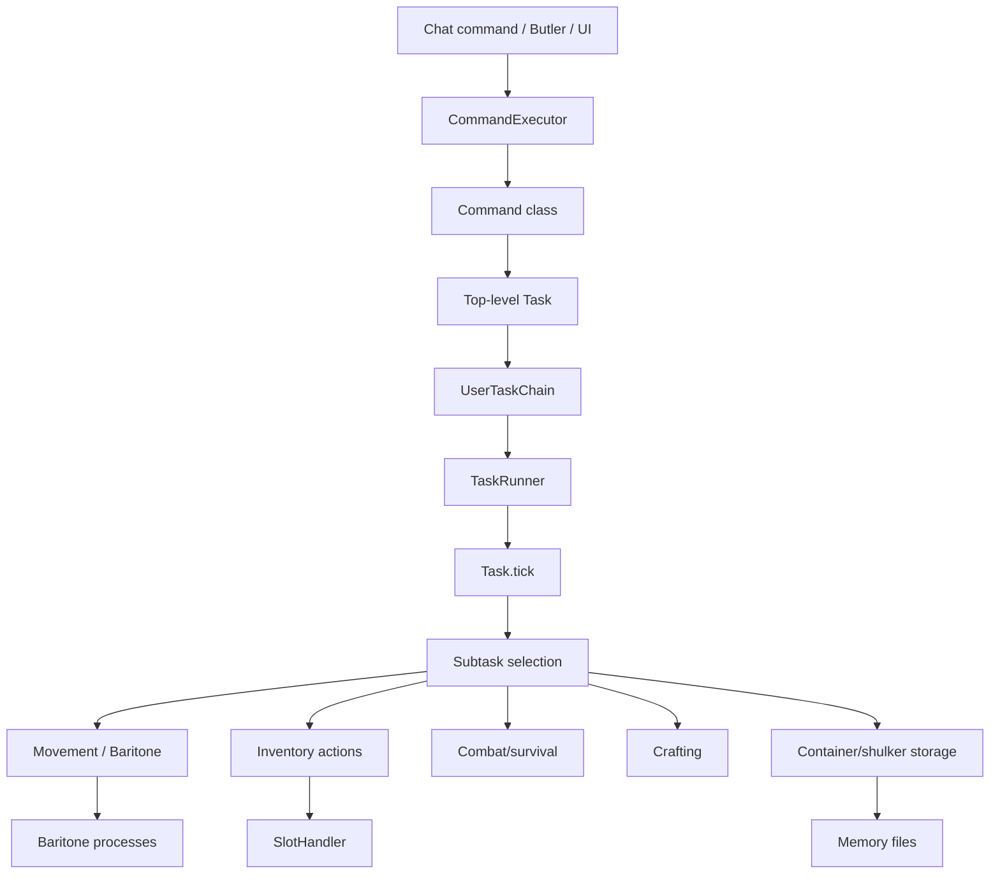
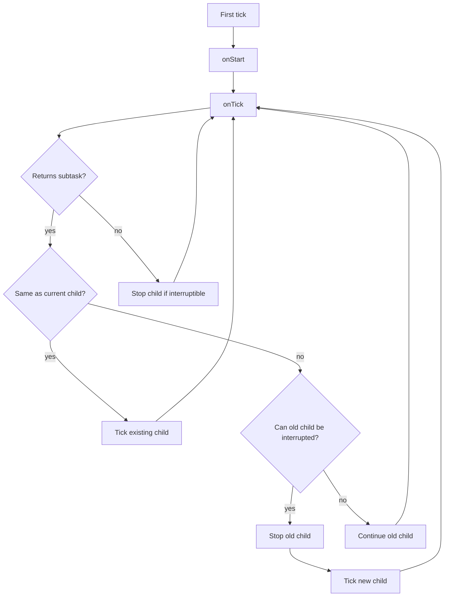
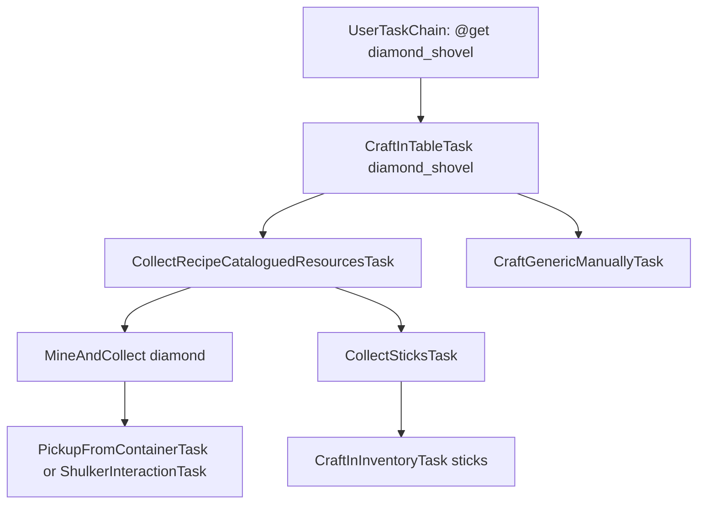
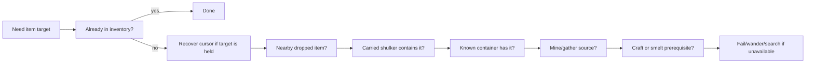
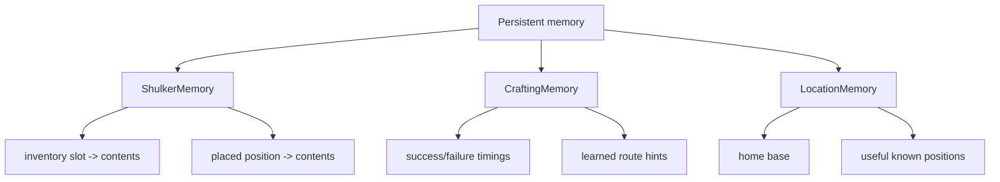
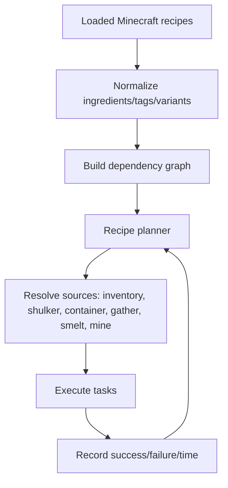

# Architecture

Belfegor is a task-driven Minecraft client agent. Commands do not directly spam clicks or movement keys. Instead, commands create tasks, tasks create subtasks, and the task runner ticks the active chain every client tick.

## High-level architecture

## Task lifecycle

Each `Task` has:

- `onStart` for setup;
- `onTick` for choosing work or returning a subtask;
- `onStop` for cleanup;
- `isFinished` for completion checks;
- `isEqual` so the scheduler can decide whether a returned task is the same continuing task or a new interrupting task.

This is powerful, but it creates a core pitfall: if two tasks both look urgent, they can oscillate. Belfegor’s inventory work therefore adds transaction locks through `ITaskCanForce` so critical slot interactions can finish before another task takes over.

## Example task tree

Most “bot hangs” are not one bad click. They are usually a bad interruption between two otherwise valid tasks. Belfegor adds force-continuation to important inventory transactions so a container or shulker transfer cannot be interrupted halfway through a cursor operation.

## Source priority

When a resource is needed, Belfegor tries to satisfy it with the cheapest/nearest source first.

In practice, the order can vary by task and safety state, but the design principle is:

1. do not duplicate work;
2. prefer already-known storage;
3. keep inventory transactions safe;
4. only gather/craft when stored resources are not available.

## Inventory transaction safety

Minecraft inventory automation is brittle because the client has multiple screen handlers and slot mappings:

- no screen open uses the player screen handler;
- inventory screen exposes the 2x2 player crafting grid;
- crafting table exposes a 3x3 grid;
- containers expose container slots followed by player slots;
- shulkers are containers with persistent NBT after pickup;
- the cursor stack exists outside normal inventory slots.

Belfegor uses several layers to stay safe:

| Layer | Purpose |
|---|---|
| `SlotHandler` | Low-level click wrapper and timing guard. |
| `InventoryManager` | Higher-level “pick/place one/all” helper. |
| Cursor recovery | Moves cursor stack into inventory/garbage before closing unsafe screens. |
| Transaction force | Prevents interruption while a container/shulker interaction is active. |
| Debug snapshots | Logs cursor, screen, handler, and slot contents around risky operations. |

## Current code pitfalls

These are known architectural risks and ongoing cleanup targets:

| Pitfall | Why it matters | Planned improvement |
|---|---|---|
| Legacy package names | Code still lives under `adris.altoclef`, which is confusing for a Belfegor-branded project. | Defer until stable; eventually migrate packages mechanically with tests. |
| Task oscillation | Two tasks can repeatedly interrupt each other if both think they should run. | More `ITaskCanForce` on atomic transactions; stronger active-subtask caching; clearer scheduler diagnostics. |
| Inventory count ambiguity | Some helpers count container/crafting slots while others require player inventory only. | Separate APIs for “usable now,” “visible nearby,” “stored,” and “crafting grid.” |
| Recipe material variants | Recipes like wood/slabs/planks may accept multiple variants, but some tasks still expect exact item targets. | Ingredient groups/tags and recipe unification. |
| Shulker identity | A picked-up shulker is an item stack with NBT, not the same object as a placed block. | Better unique IDs/fingerprints based on contents, color, slot history, and transaction state. |
| UI/config split | Some UI settings are JSON-level toggles while runtime settings live in `Settings`. | Centralize setting definitions and UI metadata. |
| Static recipe catalogue | Many tasks are hand-authored; the bundled recipe registry is not yet the main planner for every craftable item. | Move toward automated recipe planning for all loaded craftable outputs. |
| Crash recovery | The bot can log richly, but cannot always self-heal after severe screen/cursor desync. | Add watchdog recovery tasks and safe screen-reset paths. |

## Memory systems

Memory files live in `.minecraft/belfegor/` and are intentionally human-readable JSON where practical.

## Toward automated craftable-item coverage

Belfegor already includes a `RecipeRegistry` that loads `belfegor_recipes.json` and indexes recipes by output and input. The long-term plan is to use this as the foundation for an automated catalogue system:

Target behavior:

- every craftable item can be queried from the recipe registry;
- each recipe becomes a task candidate;
- ingredient alternatives are represented as groups rather than one hard-coded item;
- the planner can recursively gather/craft prerequisites;
- successful paths become preferred over slower or failed paths;
- impossible paths fail with a clear missing requirement instead of looping;
- the `@list`/UI command catalogue can show craftability, missing ingredients, and known route confidence.

## Important packages

| Path | Role |
|---|---|
| `commands/` | User-facing command entry points. |
| `tasks/` | The gameplay task tree. |
| `tasks/resources/` | Item acquisition, gathering, recipe materials. |
| `tasks/container/` | Crafting tables, storage, shulkers, smelting. |
| `tasks/movement/` | Navigation and Baritone wrappers. |
| `tasks/pvp/` | PvP automation. |
| `memory/` | Persistent shulker, crafting, and location memory. |
| `ui/` | The `C` interface and overlays. |
| `util/helpers/` | Inventory, storage, item, world, and Baritone helpers. |
| `debug/` | Structured debug logging. |

## Why the old package name still says `adris.altoclef`

The Java package name remains `adris.altoclef` because this project evolved from AltoClef code. User-facing assets, settings, mod id, jar name, mixin name, icon path, and docs are Belfegor-branded. Renaming every Java package would be a large mechanical migration with high merge/conflict risk and little runtime value, so it is intentionally deferred.
