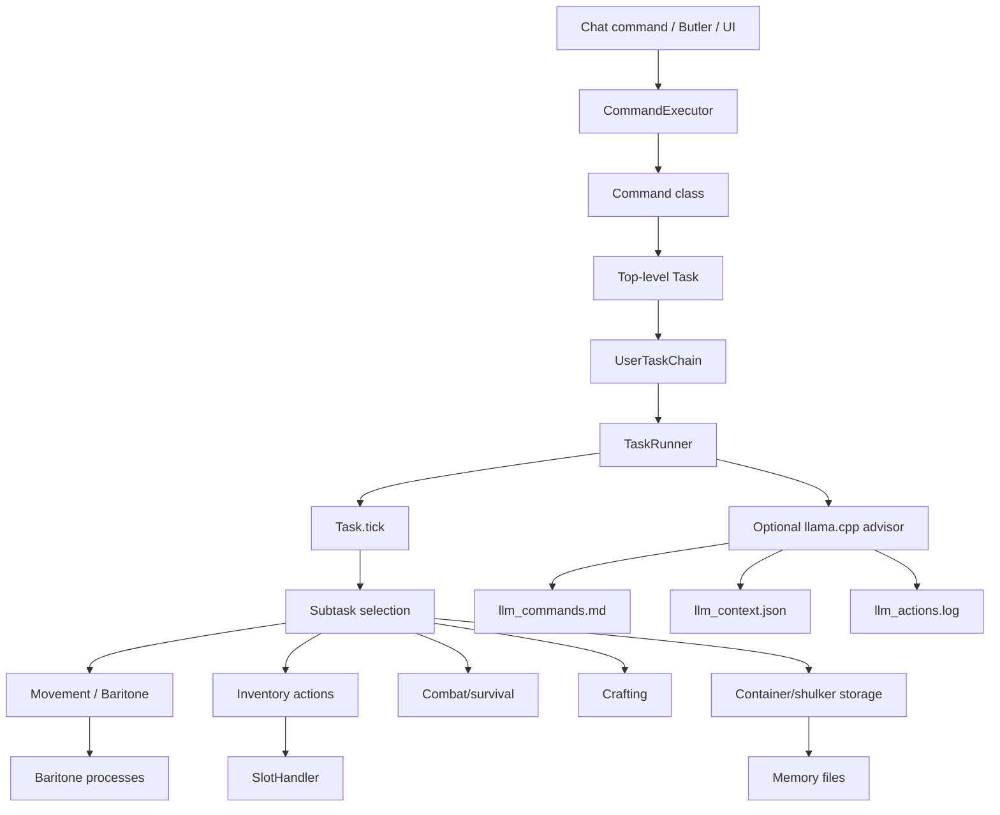
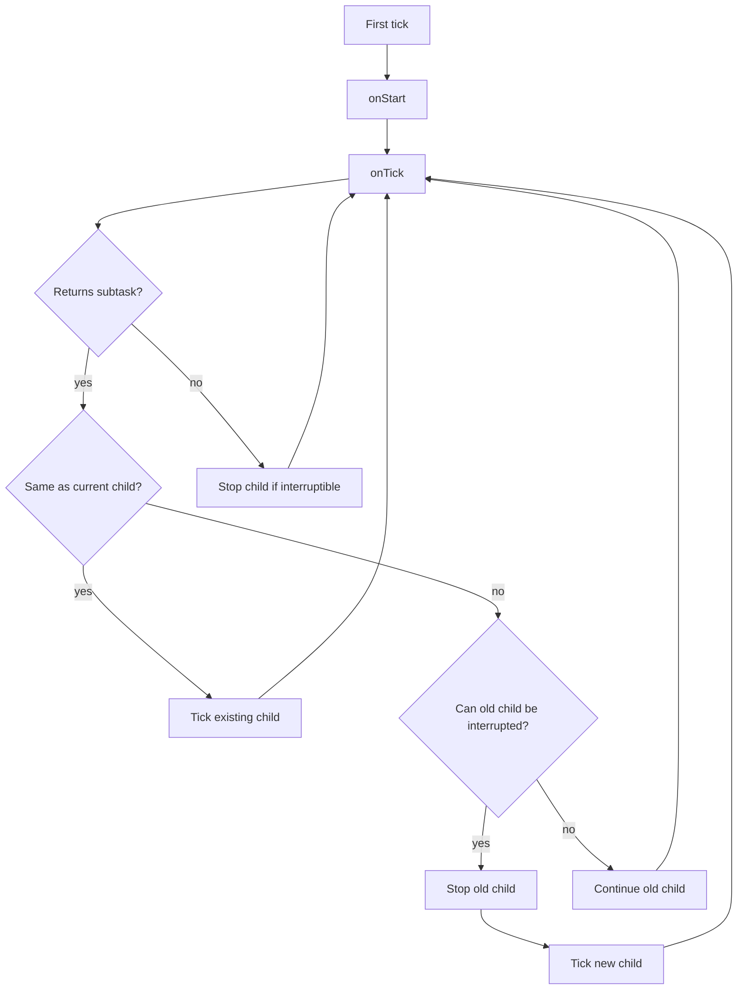
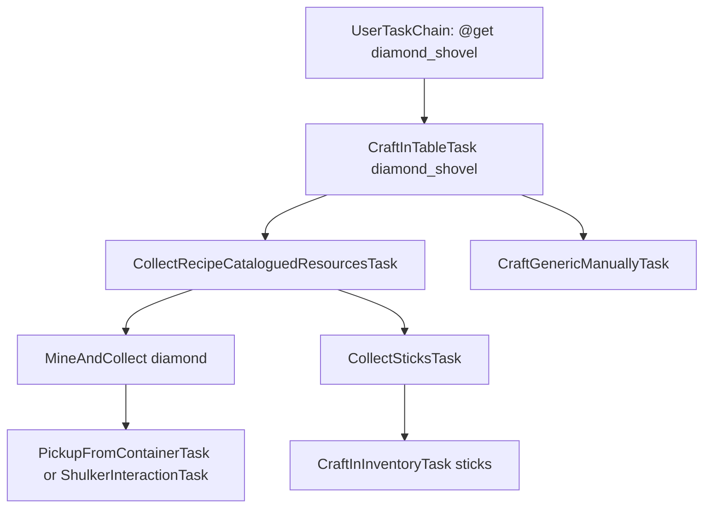
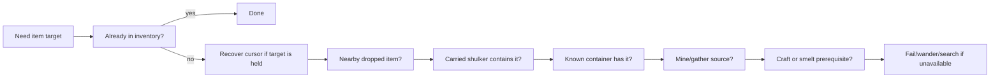
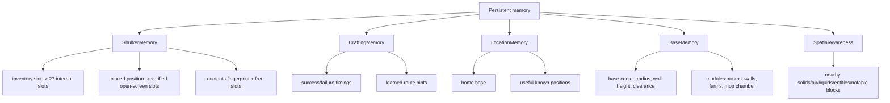
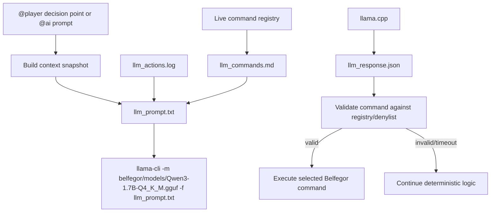
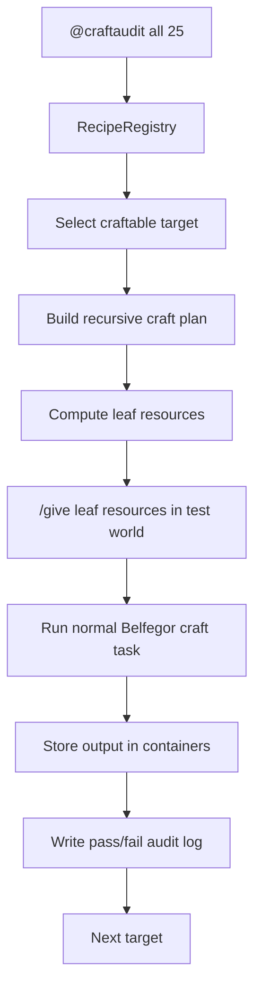
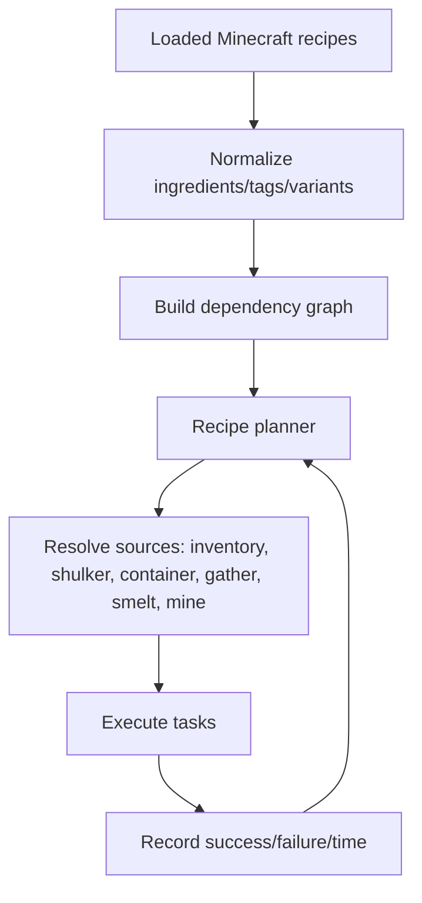

# Architecture

Belfegor is a task-driven Minecraft client agent. Commands do not directly spam clicks or movement keys. Instead, commands create tasks, tasks create subtasks, and the task runner ticks the active chain every client tick.

## High-level architecture

## Task lifecycle

Each `Task` has:

- `onStart` for setup;
- `onTick` for choosing work or returning a subtask;
- `onStop` for cleanup;
- `isFinished` for completion checks;
- `isEqual` so the scheduler can decide whether a returned task is the same continuing task or a new interrupting task.

This is powerful, but it creates a core pitfall: if two tasks both look urgent, they can oscillate. Belfegor’s inventory work therefore adds transaction locks through `ITaskCanForce` so critical slot interactions can finish before another task takes over.

## Example task tree

Most “bot hangs” are not one bad click. They are usually a bad interruption between two otherwise valid tasks. Belfegor adds force-continuation to important inventory transactions so a container or shulker transfer cannot be interrupted halfway through a cursor operation.

## Source priority

When a resource is needed, Belfegor tries to satisfy it with the cheapest/nearest source first.

In practice, the order can vary by task and safety state, but the design principle is:

1. do not duplicate work;
2. prefer already-known storage;
3. keep inventory transactions safe;
4. only gather/craft when stored resources are not available.

## Inventory transaction safety

Minecraft inventory automation is brittle because the client has multiple screen handlers and slot mappings:

- no screen open uses the player screen handler;
- inventory screen exposes the 2x2 player crafting grid;
- crafting table exposes a 3x3 grid;
- containers expose container slots followed by player slots;
- shulkers are containers with persistent NBT after pickup;
- the cursor stack exists outside normal inventory slots.

Belfegor uses several layers to stay safe:

| Layer | Purpose |
|---|---|
| `SlotHandler` | Low-level click wrapper and timing guard. |
| `InventoryManager` | Higher-level “pick/place one/all” helper. |
| Cursor recovery | Moves cursor stack into inventory/garbage before closing unsafe screens. |
| Transaction force | Prevents interruption while a container/shulker interaction is active. |
| Debug snapshots | Logs cursor, screen, handler, and slot contents around risky operations. |

The current low-level inventory rule is: a click that is blocked by a guard must remain false all the way back to the task. Earlier builds allowed a blocked `SlotHandler` click to look successful to `InventoryManager`, which let shulker/crafting code rediscover the same source slot every tick and retry forever. The guard now resets same-slot accounting per client tick and returns click acceptance to callers.

## Current code pitfalls

These are known architectural risks and ongoing cleanup targets:

| Pitfall | Why it matters | Planned improvement |
|---|---|---|
| Legacy package names | Code still lives under `adris.belfegor`, which is confusing for a Belfegor-branded project. | Defer until stable; eventually migrate packages mechanically with tests. |
| Task oscillation | Two tasks can repeatedly interrupt each other if both think they should run. | More `ITaskCanForce` on atomic transactions; stronger active-subtask caching; clearer scheduler diagnostics. |
| Inventory count ambiguity | Some helpers count container/crafting slots while others require player inventory only. | Separate APIs for “usable now,” “visible nearby,” “stored,” and “crafting grid.” |
| Recipe material variants | Recipes like wood/slabs/planks may accept multiple variants, but some tasks still expect exact item targets. | Ingredient groups/tags and recipe unification. |
| Shulker identity | A picked-up shulker is an item stack with NBT, not the same object as a placed block. | Better unique IDs/fingerprints based on contents, color, slot history, and transaction state. |
| UI/config split | Some UI settings are JSON-level toggles while runtime settings live in `Settings`. | Centralize setting definitions and UI metadata. |
| Static recipe catalogue | Many tasks are hand-authored; the bundled recipe registry is not yet the main planner for every craftable item. | Move toward automated recipe planning for all loaded craftable outputs. |
| Crash recovery | The bot can log richly, but cannot always self-heal after severe screen/cursor desync. | Add watchdog recovery tasks and safe screen-reset paths. |

## Memory systems

Memory files live in `.minecraft/belfegor/` and are intentionally human-readable JSON where practical.

### Base memory

`BaseMemory` writes `.minecraft/belfegor/belfegor_bases.json`. A base record stores:

- dimension and center block;
- build radius;
- wall height, currently four blocks for campsite and mob-farm walls;
- exterior clearance, currently five blocks around the outside of the wall;
- status, such as `set_by_player_mode`, `planned`, `clear_complete`, `wall_complete`, or `complete`;
- modules for the core room, perimeter wall, crafting anchor, smelting anchor, storage anchor, hydrated starter farm, roofed mob-farm chamber, and entrance/exit.
- module centers, dimensions, progress counters, status, and notes;
- inspection records that track checked, blocked, missing, and complete target counts.

Farm rooms are treated as infrastructure, not decoration. Belfegor builds water first: a centered 2x2 infinite water source provides bucket refills and keeps the surrounding 9x9-style farm hydrated. Only blocks inside the planned hydration range are tilled and planted.

`@player` sets a home base when it starts, and `BuildCampsiteTask` updates the base record as it clears/levels terrain, builds the floor, builds the four-high wall, builds interior room dividers, builds a roofed mob-farm chamber, places utility blocks, and plans the crop farm module. The current base radius starts at 8 and can expand up to 18 over later home-building passes. This gives the bot a persistent structure plan it can expand in later sessions instead of treating each run as a brand-new camp.

The current large-base plan uses:

- a four-high exterior perimeter wall;
- a five-block exterior safety clearance;
- cross-shaped interior room dividers with doorway gaps;
- a central core room;
- crafting, smelting, storage, and crop-farm modules;
- a roofed cobblestone mob-farm chamber with four-block-tall walls and a two-wide entrance/exit;
- remembered room centers for pathing and future expansion;
- larger farm footprints as the base radius grows.

### Spatial awareness

`SpatialAwareness` writes `.minecraft/belfegor/belfegor_spatial_awareness.json`. It scans a radius around the player and records:

- air, solid, water, lava, and liquid counts;
- open-headroom and flat-floor columns;
- whether the bot is standing in liquid or near lava;
- nearby hostile/passive entities and dropped items;
- notable blocks such as ores, workstations, chests, and shulkers;
- a compact summary string used by the LLM/player-mode context.

This is intentionally small and frequently refreshed. It gives `@player` a stable local-world snapshot without requiring expensive full-world reasoning.

## Packaged llama.cpp advisor

The local LLM advisor is packaged as Java code inside the mod and calls llama.cpp directly. It is deliberately outside the slot-clicking path:

The model can suggest high-level commands or chat text, but it cannot directly move the cursor, click slots, or bypass command validation.

## Recipe registry and craft audit loop

Belfegor includes a `RecipeRegistry` that loads `belfegor_recipes.json` from the mod jar and indexes recipes by output and input. It can now sort craftable outputs, build recursive craft plans, and expand nested recipes into leaf resources for test provisioning.

The developer command `@craftaudit <target=all> <limit=0>` uses that registry as a regression harness:

The important design choice is that the audit only uses `/give` to provision prerequisite resources. The actual craft still goes through Belfegor's normal task system, so failures expose real planner, inventory, shulker, and crafting bugs.

## Toward automated craftable-item coverage

The long-term plan is to use this registry and audit loop as the foundation for an automated catalogue system:

Target behavior:

- every craftable item can be queried from the recipe registry;
- each recipe becomes a task candidate;
- ingredient alternatives are represented as groups rather than one hard-coded item;
- the planner can recursively gather/craft prerequisites;
- successful paths become preferred over slower or failed paths;
- impossible paths fail with a clear missing requirement instead of looping;
- the `@list`/UI command catalogue can show craftability, missing ingredients, and known route confidence.
- `@craftaudit all` can continuously validate recipe coverage and write concrete failure reports for every craftable output.

## Important packages

| Path | Role |
|---|---|
| `commands/` | User-facing command entry points. |
| `tasks/` | The gameplay task tree. |
| `tasks/resources/` | Item acquisition, gathering, recipe materials. |
| `tasks/container/` | Crafting tables, storage, shulkers, smelting. |
| `tasks/movement/` | Navigation and Baritone wrappers. |
| `tasks/pvp/` | PvP automation. |
| `memory/` | Persistent shulker, crafting, and location memory. |
| `ui/` | The `C` interface and overlays. |
| `util/helpers/` | Inventory, storage, item, world, and Baritone helpers. |
| `debug/` | Structured debug logging. |

## Why the old package name still says `adris.belfegor`

The Java package name remains `adris.belfegor` because this project evolved from Belfegor code. User-facing assets, settings, mod id, jar name, mixin name, icon path, and docs are Belfegor-branded. Renaming every Java package would be a large mechanical migration with high merge/conflict risk and little runtime value, so it is intentionally deferred.

