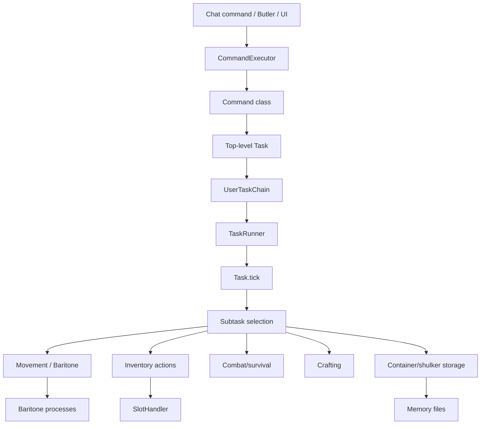
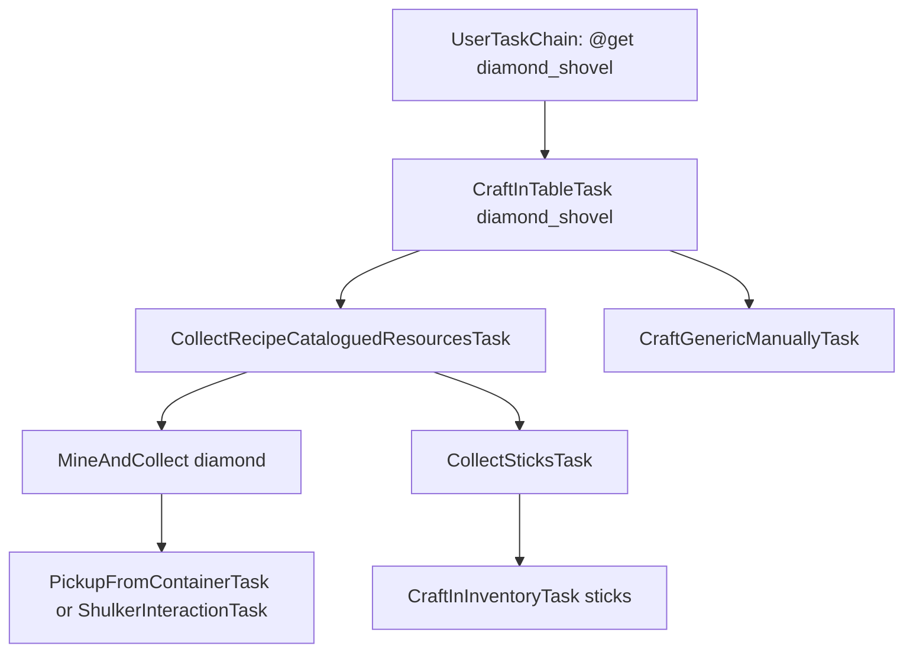
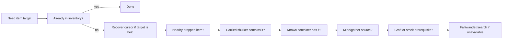
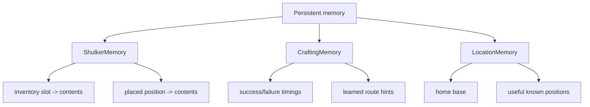

# Architecture

Belfegor is a task-driven Minecraft client agent. Commands do not directly spam clicks or movement keys. Instead, commands create tasks, tasks create subtasks, and the task runner ticks the active chain every client tick.

## High-level architecture

## Task tree

Each task may return a subtask. The runner keeps a live chain, and a new subtask can interrupt the previous one only if the previous task allows it.

This structure matters because most “bot hangs” are not one bad click. They are usually a bad interruption between two otherwise valid tasks. Belfegor adds force-continuation to important inventory transactions so a container or shulker transfer cannot be interrupted halfway through a cursor operation.

## Source priority

When a resource is needed, Belfegor tries to satisfy it with the cheapest/nearest source first.

In practice, the order can vary by task and safety state, but the design principle is:

1. do not duplicate work;
2. prefer already-known storage;
3. keep inventory transactions safe;
4. only gather/craft when stored resources are not available.

## Inventory transaction safety

Minecraft inventory automation is brittle because the client has multiple screen handlers and slot mappings:

- no screen open uses the player screen handler;
- inventory screen exposes the 2x2 player crafting grid;
- crafting table exposes a 3x3 grid;
- containers expose container slots followed by player slots;
- shulkers are containers with persistent NBT after pickup;
- the cursor stack exists outside normal inventory slots.

Belfegor uses several layers to stay safe:

| Layer | Purpose |
|---|---|
| `SlotHandler` | Low-level click wrapper and timing guard. |
| `InventoryManager` | Higher-level “pick/place one/all” helper. |
| Cursor recovery | Moves cursor stack into inventory/garbage before closing unsafe screens. |
| Transaction force | Prevents interruption while a container/shulker interaction is active. |
| Debug snapshots | Logs cursor, screen, handler, and slot contents around risky operations. |

## Memory systems

Memory files live in `.minecraft/belfegor/` and are intentionally human-readable JSON where practical.

## Important packages

| Path | Role |
|---|---|
| `commands/` | User-facing command entry points. |
| `tasks/` | The gameplay task tree. |
| `tasks/resources/` | Item acquisition, gathering, recipe materials. |
| `tasks/container/` | Crafting tables, storage, shulkers, smelting. |
| `tasks/movement/` | Navigation and Baritone wrappers. |
| `tasks/pvp/` | PvP automation. |
| `memory/` | Persistent shulker, crafting, and location memory. |
| `ui/` | The `C` interface and overlays. |
| `util/helpers/` | Inventory, storage, item, world, and Baritone helpers. |
| `debug/` | Structured debug logging. |

## Why the old package name still says `adris.altoclef`

The Java package name remains `adris.altoclef` because this project evolved from AltoClef code. User-facing assets, settings, mod id, jar name, mixin name, icon path, and docs are Belfegor-branded. Renaming every Java package would be a large mechanical migration with high merge/conflict risk and little runtime value, so it is intentionally deferred.
