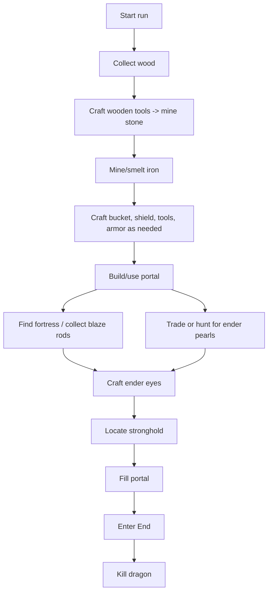
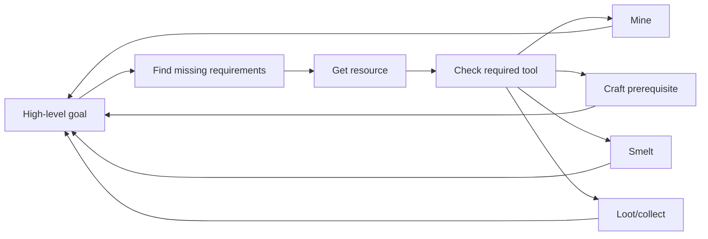
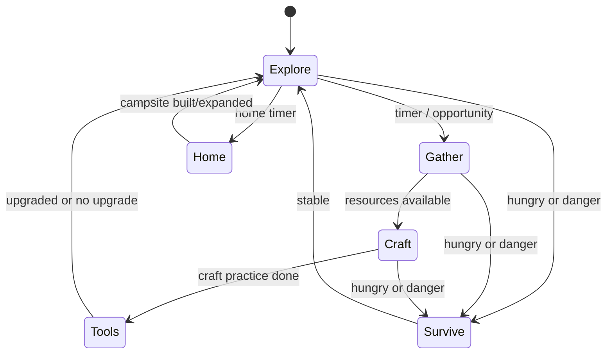

# Beat-the-game and autonomous gameplay

Belfegor contains classic beat-the-game style automation inherited from AltoClef routes plus newer Belfegor autonomous behavior.

Commands:

```text
@gamer
@marvion
@player
```

## Difference between modes

| Mode | Goal | Style |
|---|---|---|
| `@gamer` | Run the classic beat-Minecraft routine. | Goal-directed speedrun style automation. |
| `@marvion` | Run the Marvion beat-Minecraft route. | Alternative route implementation with its own task logic. |
| `@player` | Explore, gather, craft, build a home base, and improve over time. | Open-ended autonomous survival loop. |

## Beat-the-game concept

The classic route is built from smaller survival tasks:



The bot does not “understand Minecraft” like a human. It succeeds by combining:

- task decomposition;
- Baritone pathing;
- known recipes and resource tasks;
- survival chains for food, mobs, lava, and falls;
- inventory/crafting state machines;
- specialized tasks for nether travel, stronghold location, and End fight behavior.

## How route tasks choose work



For example, “collect blaze rods” may require:

- reaching the Nether;
- navigating fortress terrain;
- fighting blazes;
- staying alive;
- returning with enough rods.

Each of those is another task subtree.

## Survival chains

While a user task runs, background chains can react to danger:

| Chain | Purpose |
|---|---|
| Food chain | Eat or seek food when needed. |
| Mob defense | Fight or avoid hostile mobs. |
| MLG bucket/fall logic | Reduce fall damage when possible. |
| Lava escape | Escape lava and other dangerous blocks. |
| Death menu | Recover after death when possible. |
| Player interaction fixes | Release stuck controls/click states. |

## `@player` autonomous mode

`@player` is different from a strict speedrun. It starts a loop:



At start, `@player`:

1. saves the current position as home base;
2. enables return-home and home-defense settings;
3. records the home base in location memory;
4. begins exploring, gathering, crafting, and periodically returning home.

Current home-base behavior includes:

- preparing a crafting table;
- preparing a furnace/chest when resources allow;
- building or expanding a basic campsite wall around the base;
- returning from far away when the home timer triggers.

## Learning and memory

Belfegor has early support for remembering:

- successful crafting steps;
- failed crafting attempts;
- route timing hints;
- useful locations;
- shulker contents.

This is not yet a full reinforcement-learning system. It is more like practical memory: “this route worked,” “this item is in that shulker,” “home base is here,” and “this craft path has succeeded before.”

## Known limitations

- Beat-the-game routines are sensitive to world generation, server lag, and pathing failures.
- Nether fortress and End behavior are complex and may need iteration.
- `@player` is intentionally experimental and can make odd choices.
- Inventory bugs are the highest priority because one stuck cursor can poison any route.

## Recommended test flow

Before testing full autonomous gameplay, verify the fundamentals:

```text
@get oak_log 16
@get crafting_table
@get stone_pickaxe
@toolset stone
@get iron_ingot 3
@toolset iron
@shulker auto status
@player
```
