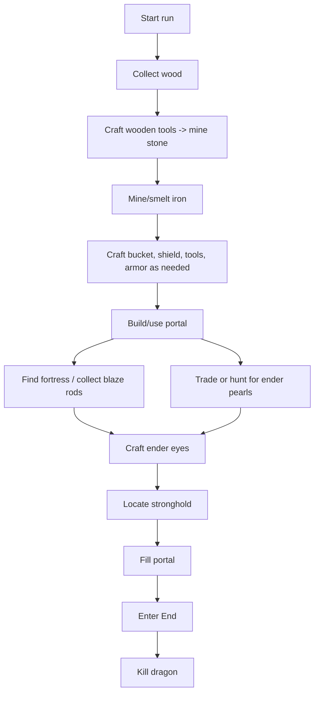
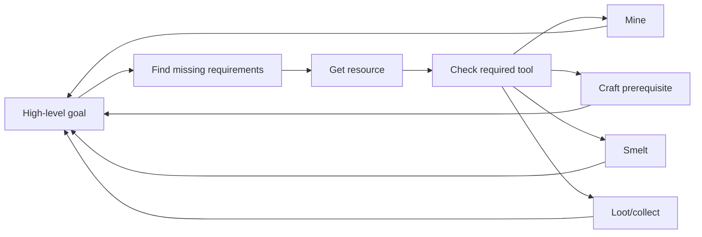
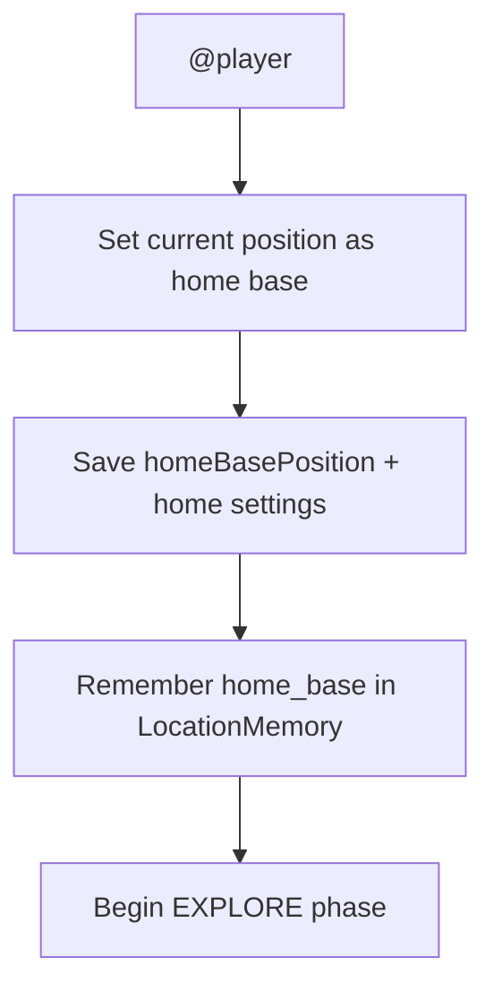
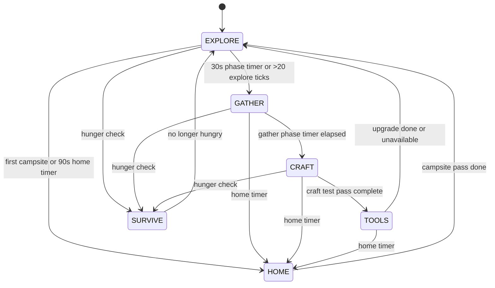
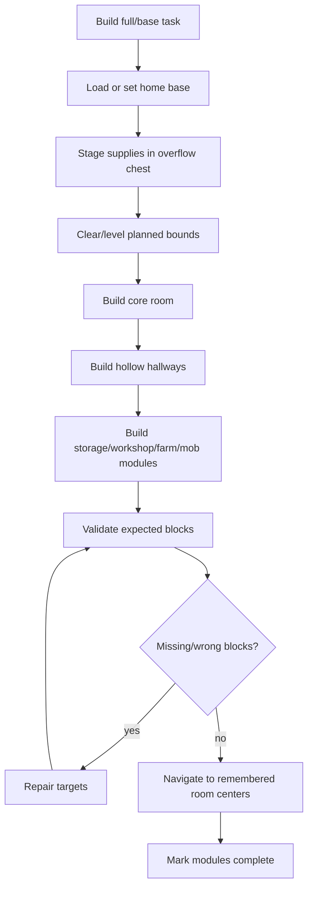

# Beat-the-game, `@player`, and autonomous gameplay

Belfegor contains classic beat-the-game automation inherited from Belfegor-style routes plus newer Belfegor autonomous behavior.

Commands:

```text
@gamer
@marvion
@player
```

## Difference between modes

| Mode | Goal | Style |
|---|---|---|
| `@gamer` | Run the classic beat-Minecraft routine. | Goal-directed speedrun style automation. |
| `@marvion` | Run the Marvion beat-Minecraft route. | Alternative route implementation with its own task logic. |
| `@player` | Explore, gather, craft, build a home base, use shulkers, and improve over time. | Open-ended autonomous survival loop. |

## Beat-the-game concept

The classic route is built from smaller survival tasks:



The bot does not "understand Minecraft" like a human. It succeeds by combining:

- task decomposition;
- Baritone pathing;
- known recipes and resource tasks;
- survival chains for food, mobs, lava, and falls;
- inventory/crafting state machines;
- specialized tasks for nether travel, stronghold location, and End fight behavior.

## How route tasks choose work



For example, "collect blaze rods" may require:

- reaching the Nether;
- navigating fortress terrain;
- fighting blazes;
- staying alive;
- returning with enough rods.

Each of those is another task subtree.

## Survival chains

While a user task runs, background chains can react to danger:

| Chain | Purpose |
|---|---|
| Food chain | Eat or seek food when needed. |
| Mob defense | Fight or avoid hostile mobs. |
| MLG bucket/fall logic | Reduce fall damage when possible. |
| Lava escape | Escape lava and other dangerous blocks. |
| Death menu | Recover after death when possible. |
| Player interaction fixes | Release stuck controls/click states. |

## `@player` autonomous mode

`@player` is different from a strict speedrun. It starts an open-ended loop where the bot tries to survive, improve tools, gather useful items, practice crafts, maintain a home base, and use shulkers when inventory pressure gets high.

If `llmAdvisorEnabled` and `llmAdvisorInPlayerMode` are enabled, player mode can ask the Packaged llama.cpp advisor for the next command. The default advisor model is `belfegor/models/Qwen3-1.7B-Q4_K_M.gguf`. The model receives the command catalogue, current phase, fallback plan, goal, last action, planned action, inventory, and remembered shulker contents. Returned commands are validated before execution, and invalid/unsafe commands are ignored.

Current implementation lives in:

```text
src/main/java/adris/Belfegor/tasks/PlayerExplorationTask.java
```

### Startup behavior

When `@player` starts, Belfegor:

1. sets the current block position as `_homeBase`;
2. writes that position into `belfegor_settings.json` as `homeBasePosition`;
3. enables `returnHomeOnIdle`;
4. enables `defendHomeBase`;
5. sets `homeBaseDefenseRadius` to `32`;
6. records a `home_base` entry in `LocationMemory`;
7. starts in `EXPLORE` phase.



### Full current `@player` loop

The code currently cycles through these phases:



### Priority checks before phases

Every tick, before the phase-specific logic runs, `@player` does several priority checks:

| Priority | Check | Current behavior |
|---|---|---|
| Danger | Health below 8 or at least 3 hostiles within 8 blocks. | Runs a flee/wander task. |
| Hunger | Every 10 seconds, food level below 14. | Switches to `SURVIVE`. |
| Shulkers | Every 20 seconds, carried shulker exists and at least 30 main inventory slots are occupied. | Runs auto-store into shulkers for eligible items. |
| llama.cpp advisor | Cooldown from `llmAdvisorCooldownSeconds`, disabled by default. | Asks `belfegor/models/Qwen3-1.7B-Q4_K_M.gguf` or configured llama.cpp model for the next validated command. |
| First tool | Missing wooden pickaxe. | Gets a wooden pickaxe before continuing. |
| Home | First campsite not built or 90-second home timer elapsed. | Switches to `HOME` unless currently surviving. |

This priority layer is why `@player` may interrupt its own exploration to eat, flee, sort inventory, or return home.

### EXPLORE phase

Current behavior:

- increments an exploration counter;
- wanders using `TimeoutWanderTask(true)`;
- after 30 seconds or more than 20 explore ticks, switches to `GATHER`.

The present exploration phase is intentionally simple. It is a roaming/scouting behavior, not yet a semantic map builder.

### GATHER phase

Gathering checks opportunities in this order:

1. high-value dropped items;
2. dropped food;
3. nearby passive mobs for food;
4. nearby hostile mobs with useful drops;
5. tracked ore opportunities.

High-value dropped items currently include:

- diamond;
- iron ingot;
- gold ingot;
- ender pearl;
- blaze rod;
- golden apple;
- experience bottle;
- ender eye.

Mob preferences:

1. cows for beef;
2. pigs for porkchops;
3. chickens for chicken;
4. selected hostiles for drops such as gunpowder, bones, and string.

Mining opportunities currently look for tracked coal, iron ore, and diamond ore, gated by basic tool availability.

### CRAFT phase

Every 20 seconds, the craft phase tries a short list of useful craft targets if they are task-catalogued and not already present:

```text
crafting_table
torch
chest
furnace
campfire
wooden_pickaxe
wooden_axe
wooden_shovel
wooden_sword
stone_pickaxe
stone_axe
stone_shovel
stone_sword
iron_pickaxe
iron_shovel
shield
stick
ladder
oak_planks
bread
bucket
```

This is the beginning of the future “practice every craftable item” system, but it is currently a curated starter list.

### TOOLS phase

Tool upgrades are simple and direct:

- if the bot has a wooden pickaxe but not a stone pickaxe, get a stone pickaxe;
- if the bot has a stone pickaxe but not an iron pickaxe, get an iron pickaxe;
- then return to `EXPLORE`.

### SURVIVE phase

If the bot is hungry:

1. tries to get `cooked_beef`;
2. falls back to `beef`;
3. returns to `EXPLORE` when food level is stable.

### HOME phase

The home phase is where base-building happens. It:

1. reloads home base from settings if needed;
2. returns home if farther than 48 blocks from the saved base;
3. ensures a crafting table;
4. ensures a furnace if there are at least 8 cobblestone/cobbled deepslate available;
5. ensures a chest;
6. builds, validates, or expands the remembered modular base with the campsite/full-base construction tasks;
7. increments `_campBuildCount`;
8. returns to `EXPLORE`.

## Exact base-building behavior

Current implementation is split across:

```text
src/main/java/adris/belfegor/tasks/construction/BuildCampsiteTask.java
src/main/java/adris/belfegor/tasks/construction/BuildFullBaseTask.java
src/main/java/adris/belfegor/tasks/construction/BuildBaseExpansionTask.java
src/main/java/adris/belfegor/tasks/construction/BuildBaseValidationTask.java
src/main/java/adris/belfegor/tasks/construction/BuildImportedSchematicTask.java
```

It is deliberately modular. The current base is not just a small wall: it records a home/core room, connected hallways, storage/workshop/farm/mob modules, route centers, inspection state, and validation data.

### Current structure

| Part | Behavior |
|---|---|
| Center | The saved home/core room center. |
| Radius | Starts around a radius-8 home plan and can expand toward larger footprints over later passes. |
| Wall height | Four blocks for main perimeter and mob-room walls. |
| Wall shape | Generated room/module footprints connected by hollow hallways. |
| Doorways/halls | Two-wide connected hallways with remembered room centers. |
| Wall materials | Cobblestone-first for durable base construction; dirt is treated as terrain/farm material, not a preferred structural block. |
| Storage | Staging/overflow chest in the core room when inventory pressure or construction supplies require it. |
| Farm | Hydrated farm module with a 2x2 infinite water source and water holes before tilling/planting. |
| Mob room | Roofed cobblestone chamber with four-block-tall walls and a controlled entrance/exit. |

### Modular base layout

Top-down concept, not exact block rendering:

```text
              [Mob chamber]
                    ||
[Storage] == [Core/Home] == [Workshop]
                    ||
              [Hydrated farm]

Each room has remembered bounds and a remembered center. Hallways are hollow
and pathable so the bot should navigate through the base instead of mining
through finished walls.
```

### Build algorithm



### Planned base improvements

The current base is the first durable scaffold. Planned upgrades:

- storage wall with labelled/reserved containers;
- shulker unloading/loading station;
- mine entrance module;
- richer farm plots for wheat/carrots/potatoes;
- animal pen module;
- safe bed/sleep room;
- furnace/smoker/blast furnace cluster;
- portal pad;
- defensive lighting;
- pathable gates instead of a simple open doorway;
- imported schematic placement/repair using the same validation model.

## Learning and memory

Belfegor has early support for remembering:

- successful crafting steps;
- failed crafting attempts;
- route timing hints;
- useful locations;
- shulker contents.

This is not yet a full reinforcement-learning system. It is practical memory: “this route worked,” “this item is in that shulker,” “home base is here,” and “this craft path has succeeded before.”

## Known limitations

- Beat-the-game routines are sensitive to world generation, server lag, and pathing failures.
- Nether fortress and End behavior are complex and may need iteration.
- `@player` is intentionally experimental and can make odd choices.
- Exploration does not yet build a semantic map of the world.
- Base construction is now modular and validation-backed, but still needs more terrain/interruption tests before it should be considered a fully general builder.
- Inventory bugs remain the highest priority because one stuck cursor can poison any route.

## Recommended test flow

Before testing full autonomous gameplay, verify the fundamentals:

```text
@get oak_log 16
@get crafting_table
@get stone_pickaxe
@toolset stone
@get iron_ingot 3
@toolset iron
@shulker auto status
@player
```

