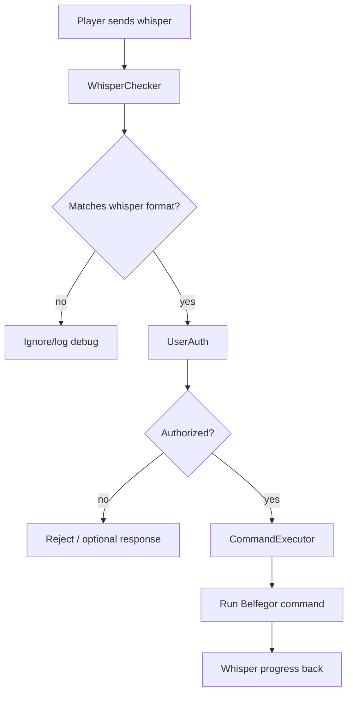
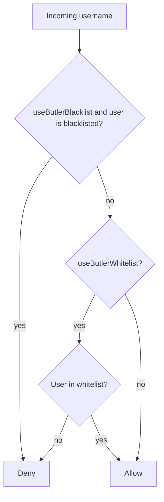

# Butler and multiplayer guide

Belfegor is a client-side Minecraft automation mod. It can run in singleplayer or while connected to multiplayer, but server use is a social, rules, and reliability question as much as a technical one.

## Can Belfegor run on a server?

Technically, yes, if:

- the Minecraft version is compatible;
- Fabric and required mods load correctly;
- the server does not block or kick the client for the behavior;
- the user has permission to use automation there.

Practically, many servers prohibit bots, pathing automation, combat automation, or remote-control clients. Always check the rules.

## Can Belfegor run on an anarchy server?

Technically, it may run like any client-side modded client, but anarchy servers are harsh test environments:

- high latency can break inventory timing;
- anti-cheat can interfere with pathing, block placement, or combat;
- other players can kill, trap, move, or exploit the bot;
- chat/whisper formats may be custom;
- restarts/queues/disconnects can interrupt long tasks;
- terrain griefing may confuse pathfinding and resource logic.

Belfegor does not promise stealth or bypasses. It is not designed as an anti-cheat evasion project. It is best treated as an automation agent for allowed environments.

## What is Butler?

The Butler system lets authorized players send commands to the bot through whispers/private messages. It effectively makes the bot a remote-controlled assistant.



Example:

```text
/msg BotName get oak_log 32
/msg BotName follow Steve
/msg BotName shulker store diamond 3
```

If `requirePrefixMsg` is true, the player must include the normal command prefix:

```text
/msg BotName @get oak_log 32
```

## Authorization files

Belfegor creates:

```text
.minecraft/belfegor/belfegor_butler_whitelist.txt
.minecraft/belfegor/belfegor_butler_blacklist.txt
```

The authorization logic is:



Important default:

- `useButlerBlacklist = true`
- `useButlerWhitelist = false`

That means the fallback is permissive: everyone not on the blacklist is authorized. For multiplayer, you should almost always enable whitelist mode.

## Butler config

The Butler config is loaded from:

```text
configs/butler.json
```

Key fields:

| Setting | Meaning |
|---|---|
| `useButlerBlacklist` | Reject users listed in `belfegor_butler_blacklist.txt`. |
| `useButlerWhitelist` | Only allow users listed in `belfegor_butler_whitelist.txt`. |
| `whisperFormats` | Server-specific private-message formats to parse. |
| `whisperFormatDebug` | Logs parsed/unparsed whisper diagnostics. |
| `sendAuthorizationResponse` | Sends rejection message to unauthorized users. |
| `failedAuthorizationResposne` | Rejection message text. |
| `requirePrefixMsg` | Requires `@` prefix in whispers when true. |

## Recommended safe Butler setup

1. Enable whitelist mode.
2. Add only trusted usernames to `belfegor_butler_whitelist.txt`.
3. Keep blacklist enabled.
4. Set `requirePrefixMsg` to true if you want normal private messages to remain normal chat.
5. Test with harmless commands first:

   ```text
   @status
   @coords
   @inventory
   ```

6. Only then test movement/resource commands.

## Fun multiplayer uses

In allowed environments, Butler can be genuinely fun:

- friends can ask the bot to deliver materials;
- a base group can send it to gather logs or cobblestone;
- a trusted teammate can say `follow me`;
- users can remotely inspect inventory;
- the bot can act like a camp helper while players build;
- shulker logistics can be delegated with `@shulker store` and `@shulker retrieve`.

## Risks

| Risk | Why it matters |
|---|---|
| Whitelist disabled | Other players may command the bot if whispers parse correctly. |
| Custom whisper formats | A too-loose format can parse unintended messages. |
| Server rules | Automation may be banned. |
| Combat commands | PvP automation can escalate conflict or violate rules. |
| Public logs/chat | Bot responses can reveal inventory or position. |
| Griefing/trapping | Other players can manipulate the bot's environment. |

Use Butler like giving someone remote control of your Minecraft account. Trust matters.
