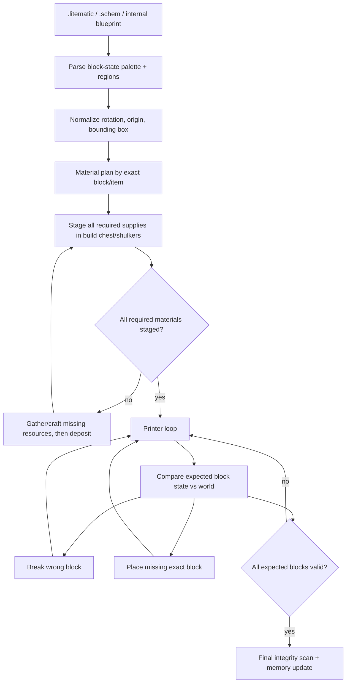

# Schematic engine direction

Belfegor's base builder is moving from hard-coded room routines toward a real schematic printer pipeline.

Existing client-side printers such as Litematica Printer-style Fabric mods prove the useful shape of the problem: keep an overlay of expected block states, compare it to the world, place only correct blocks, break wrong blocks when repair is enabled, throttle interactions, and handle hard placements with side-aware/air-place style fallbacks. Belfegor should use the same architecture, but with one major difference: it is an autonomous agent, not a player-assist macro. That means material gathering, staged storage, shulker/chest withdrawal, pathing, and repair validation are part of the build loop.

## Target pipeline



## Current implementation bridge

The current `BuildRegionSchematicTask` is Belfegor's bridge layer:

- it receives an expected map of world positions to desired blocks;
- it builds with Baritone's builder process when that is productive;
- it counts missing exact blocks instead of accepting dirt as a generic construction material;
- it destroys wrong target blocks before replacing them;
- it now looks for a remembered construction staging chest and withdraws working batches before building;
- it logs missing/staged supply state so build failures can be diagnosed from `belfegor_debug.log`.

The current `BuildBaseValidationTask` now loads an authoritative saved blueprint before checking the world. Memory alone is not enough to mark a room complete. If dirt or air exists where the campsite blueprint expects cobblestone, validation reruns repair.

If `.minecraft/schematics/test/camp.litematic` exists, `@build validate` imports that Litematica v7 file first and treats it as the authoritative camp blueprint. The loader reads:

- `Metadata` for name/size information;
- each entry in `Regions`;
- each region `Position` and signed `Size`;
- `BlockStatePalette` entries, including block-state properties;
- packed `BlockStates` long arrays.

Non-air palette entries are converted into world-space expected blocks at the remembered base origin. The converted blueprint is also saved into Belfegor's readable JSON schematic format for debugging.

When `@build camp`, `@build full`, or `@build validate` touches the core campsite, Belfegor writes/loads:

```text
.minecraft/belfegor/schematics/base_core_<dimension>_<x>_<y>_<z>.belfegor_schematic.json
```

This internal schematic file stores exact expected world positions and block IDs for the core base. It is intentionally human-readable so failures can be inspected in Git diffs or debug logs while the base-builder is still changing quickly.

### Relationship to Baritone, `#build`, and Litematica

The live Baritone command surface already exposes:

- `#build <filename>` / `#build <filename> <x> <y> <z>` for Baritone schematic builds;
- `#litematica` for building the currently loaded Litematica schematic;
- `#sel` operations for selection-based clearing/filling/debugging.

Belfegor should use those capabilities as execution backends, not as the only source of truth. The autonomous layer still needs to decide:

- what structure should exist;
- where every block belongs;
- whether the world currently matches;
- what supplies are missing;
- where supplies are staged;
- when to gather, deposit, withdraw, repair, or pause.

That is why the internal schematic file exists. `.litematic` import now parses Litematica's palette/regions into the same internal blueprint model, then the existing validation/material/build loop can use it without depending on Litematica's UI or input handling.

## Material staging rule

Long term, construction should not begin from a cluttered inventory. It should:

1. calculate the complete material plan;
2. create or choose a build staging chest near the structure origin;
3. gather/craft every required item;
4. deposit supplies into that chest or into shulkers inside that chest;
5. withdraw only an active working batch while printing;
6. pause with a clear reason if materials are not staged and cannot currently be obtained.

This keeps inventory pressure predictable and prevents the bot from discarding important supplies while building large structures.

## Next engineering steps

- Extend `.litematic` parsing beyond the current default camp import into explicit user commands such as `@schematic load`.
- Add Sponge `.schem` parsing into the internal schematic model.
- Continue improving full block-state placement for stairs, slabs, doors, trapdoors, logs, crops, water, and redstone.
- Add export to Baritone-compatible `.schematic` or direct Baritone build-process adapters where useful.
- Add a safe optional integration path for Litematica-loaded schematics via Baritone `#litematica`/API support when Litematica is installed.
- Add a printer scheduler that orders blocks by support dependencies: floors/supports first, walls next, ceilings/overhangs last.
- Add explicit air/clearance cells so the bot can remove debris where a schematic expects empty space.
- Add staged supply accounting for shulkers inside the construction chest.
- Add commands such as `@schematic load`, `@schematic materials`, `@schematic stage`, `@schematic build`, `@schematic repair`, and `@schematic validate`.
