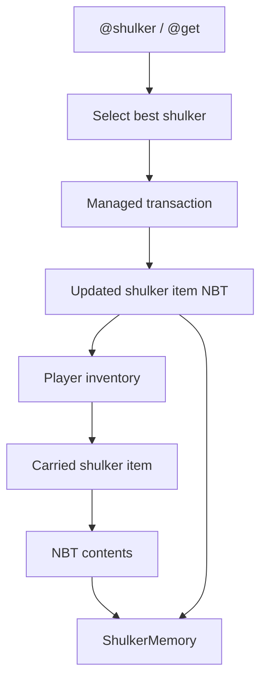
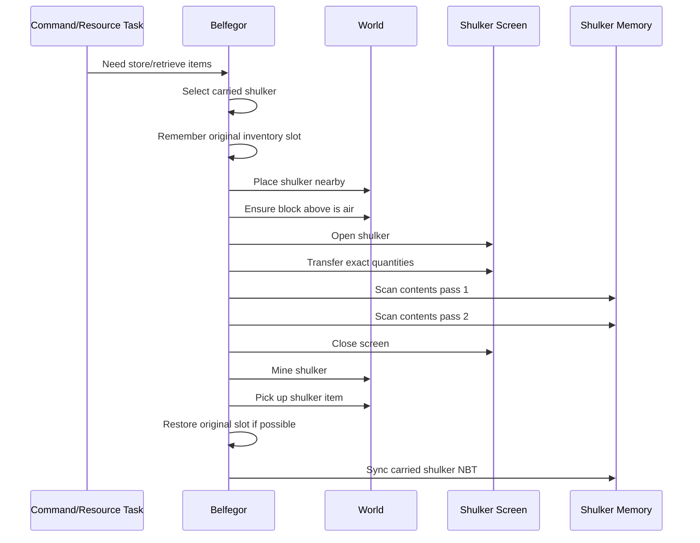
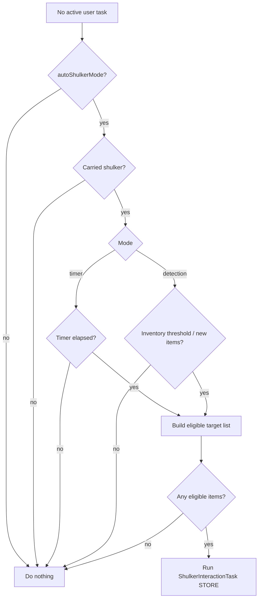
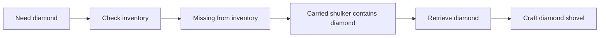

# Shulker-box management

Belfegor treats carried shulker boxes as sub-inventories. The intent is that resources inside a carried shulker can be used like regular inventory: store diamonds now, retrieve them later for `@get diamond_shovel`, and keep the bot’s main inventory from filling with loose stacks.

## Mental model



The shulker is not treated as a magical remote inventory. Minecraft does not allow moving items in/out of a shulker while it is still an item in your inventory. Belfegor must place it, open it, transfer items, close it, break it, and pick it back up.

## Full transaction flow



## Commands

```text
@shulker list
@shulker find diamond
@shulker store diamond 3
@shulker store [diamond 3, stick 16]
@shulker retrieve stick 8
@shulker auto on
@shulker auto off
@shulker auto status
@shulker auto timer
@shulker auto detection
@shulker auto run
```

## Store vs retrieve

| Operation | Source | Destination | Example |
|---|---|---|---|
| Store | Player inventory | Open shulker slots | `@shulker store diamond 3` |
| Retrieve | Open shulker slots | Player inventory | `@shulker retrieve stick 8` |
| Auto store | Eligible player inventory items | Carried shulker | `@shulker auto run` |

## Auto shulker mode

Auto mode stores eligible ordinary inventory items into carried shulkers while the bot is idle.



Modes:

- `timer` - periodically redeposits eligible items after `autoShulkerTimerSeconds`.
- `detection` - sorts when inventory fill/new item detection crosses `autoShulkerInventoryThreshold`.

Auto mode excludes:

- shulker boxes;
- tools;
- weapons;
- armor;
- shields;
- bows/crossbows/tridents/maces;
- flint and steel;
- shears;
- fishing rods;
- damaged gear.

Shulkers are never stored inside shulkers.

## How a shulker is chosen

For retrieval, Belfegor prefers a carried shulker whose NBT contents include the requested item.

For storage, Belfegor prefers:

1. a shulker already containing matching items;
2. otherwise a shulker with more free space.

This keeps item groups together where possible instead of scattering every deposit across random boxes.

## Crafting integration

When `@get` needs an ingredient and that item exists inside a carried shulker, Belfegor should retrieve from the shulker before gathering or crafting more.

Example:

```text
@get diamond_shovel
```

If a carried shulker contains diamonds, the expected flow is:



## Memory file

Shulker memory is stored at:

```text
.minecraft/belfegor/belfegor_shulker_memory.json
```

The `C` UI shulker tab displays indexed shulkers and known contents. `@shulker list` prints the same information in chat/log form.

## Debugging shulkers

Relevant debug tags in `belfegor_debug.log`:

| Tag | Meaning |
|---|---|
| `SHULKER-STATE` | Transaction phase transitions. |
| `SHULKER-TRANSFER` | Individual item moves. |
| `SHULKER-CATALOG` | Catalog passes and contents. |
| `SHULKER-ERROR` | Failed shulker assumptions. |
| `SHULKER-FORCE` | Transaction lock prevented interruption. |
| `CONTAINER-FORCE` | Container pickup transaction lock prevented interruption. |

If a shulker is being opened and closed repeatedly, search the log for `TASK-STOP` and `TASK-START` around the same timestamp. A repeated alternation means another task is interrupting the shulker transaction.
