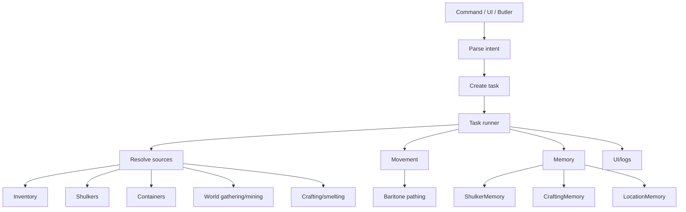
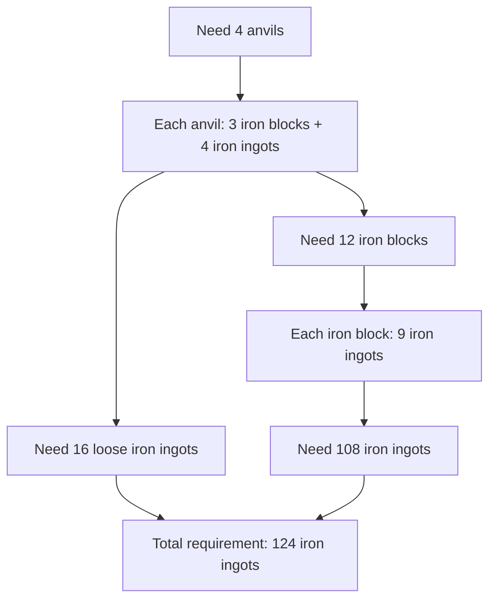
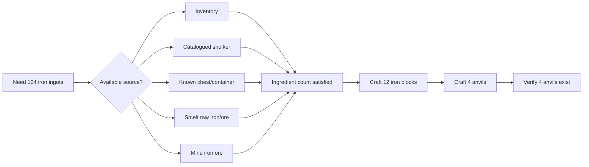
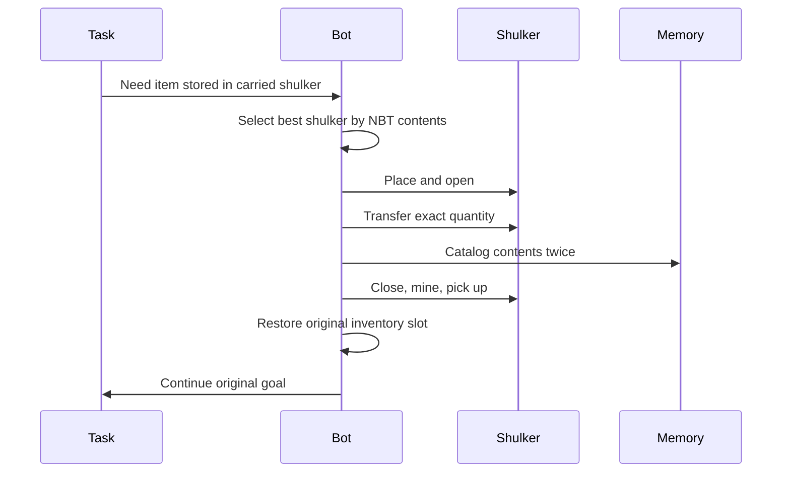

# Belfegor whitepaper

## Abstract

Belfegor is a Fabric client-side Minecraft automation agent for Minecraft `1.21.4`. It combines command parsing, task decomposition, Baritone movement, resource collection, crafting state machines, shulker-box sub-inventory management, persistent memory, an in-game UI, and optional Butler remote control to let a player issue high-level goals such as `@get diamond_shovel`, `@stacked`, `@shulker retrieve stick 8`, or `@player`.

Belfegor is intended as an experimental, practical automation bot: strong enough to be useful and fun, honest enough to expose its limitations, and instrumented enough that failures can be debugged.

## Design philosophy

Belfegor is built around four ideas:

1. **High-level commands should become task trees.** A user should not need to script every click.
2. **Inventory actions must be treated as transactions.** Most catastrophic bot bugs come from interrupted slot operations.
3. **Storage should include shulkers and memory, not just the visible inventory.**
4. **The bot should explain itself through UI and logs.** A silent stuck bot is nearly impossible to improve.

## Core capabilities

| Capability | Current state |
|---|---|
| Command system | Implemented with `@` prefix, help metadata, examples, chaining, UI command page. |
| Resource gathering | Implemented for many catalogued items. |
| Crafting | Implemented for inventory and crafting table recipes with cursor recovery. |
| Smelting | Supported through furnace/smoker/blast-furnace tasks. |
| Movement | Uses Baritone-style pathing wrappers. |
| Containers | Can store/retrieve from nearby/known containers. |
| Shulkers | Places, opens, transfers, catalogs, breaks, picks up, and remembers carried shulkers. |
| Auto shulker sorting | Timer/detection modes for eligible non-tool items. |
| Offline recipes | Bundled `belfegor_recipes.json` lets the agent reason about craftable-item dependencies without internet access. |
| Craft auditing | Developer command `@craftaudit` runs recipe expansion, resource provisioning, real crafting, storage, and pass/fail logging in a cheat-enabled test world. |
| PvP prep | `@stacked`, `@toolset`, and advanced PvP tasking exist. |
| Autonomous play | `@player` explores, gathers, crafts, manages shulkers, and builds a basic home campsite. |
| Beat-the-game | Classic `@gamer` and `@marvion` routes are present. |
| Butler | Authorized players can command the bot via whispers. |
| UI | `C` opens tabs for tasks, commands, settings, shulkers, and logs. |
| Debugging | Structured log tags for task, crafting, shulker, container, and screen states. |

## What Belfegor cannot do yet

Belfegor should not be oversold. Current limits:

- It is not a full general Minecraft AI.
- Its recipe-driven planner is meant to work across normal Minecraft `1.21.4` craftable items, but some recipes still depend on better tag/variant normalization or acquisition logic.
- Recipe variants and tags still need stronger normalization.
- `@player` does not yet build complex bases or farms.
- It can get confused by server lag, plugins, protected regions, or anti-cheat.
- It cannot guarantee beat-the-game success in every seed.
- It does not guarantee safe behavior in hostile multiplayer.
- It does not provide stealth or ban evasion.
- It can still hit inventory edge cases, especially after unusual interruptions.

## System overview



## How Belfegor knows how to craft an item

Belfegor's crafting system is designed around a recipe graph, not around one-off item scripts. A command such as:

```text
@get anvil 4
```

is interpreted as:

```text
target item: minecraft:anvil
target count: 4
```

The bot then runs the same acquisition loop it uses for other craftable items:

1. **Normalize the target.** Convert user input such as `anvil`, `minecraft:anvil`, or command aliases into a concrete item id.
2. **Count existing supply.** Check visible inventory, cursor state, remembered shulkers, and known containers.
3. **Load recipe candidates.** Find the Minecraft `1.21.4` recipe or recipes that produce the target item.
4. **Choose a recipe.** Prefer recipes whose ingredients are already available or easiest to obtain.
5. **Expand dependencies.** If an ingredient is itself craftable, recursively expand that recipe.
6. **Resolve sources.** For each leaf ingredient, choose between inventory, shulkers, containers, smelting, mining, gathering, mob drops, or other acquisition tasks.
7. **Execute subtasks.** Retrieve stored items, mine resources, smelt inputs, or craft prerequisite components.
8. **Craft the target.** Use inventory crafting or a crafting table depending on recipe size.
9. **Verify count.** Recount the output and continue until the requested quantity is present or the task is blocked.

The key is that each ingredient can itself become a new `@get`-style subgoal. This turns crafting into a dependency tree.

### Example: `@get anvil 4`

The vanilla anvil recipe is:

```text
1 anvil = 3 iron blocks + 4 iron ingots
```

For four anvils:

```text
4 anvils = 12 iron blocks + 16 iron ingots
```

Iron blocks are also craftable:

```text
1 iron block = 9 iron ingots
12 iron blocks = 108 iron ingots
```

So the full minimum material requirement is:

```text
108 ingots for blocks
+16 loose ingots
=124 iron ingots total
```

The expanded dependency tree looks like this:



At that point the planner does not care whether the ingots come from the hotbar, the main inventory, a shulker, a chest, smelting raw iron, or mining ore. They are all sources that can satisfy the same ingredient requirement.



### Why this generalizes to craftable items in 1.21.4

For every normal craftable Minecraft `1.21.4` item, the shape of the problem is the same:

```text
desired output
-> recipe
-> ingredients
-> ingredient sources
-> prerequisite recipes
-> execution
-> verification
```

That means Belfegor does not need a unique hand-written "make an anvil" brain, a unique "make a composter" brain, and a unique "make a shovel" brain. It needs:

- recipe data;
- ingredient matching;
- a source resolver;
- reliable inventory transactions;
- movement/gathering/smelting subtasks;
- output verification.

The same loop handles simple one-step crafts, such as sticks, and deeper crafts, such as anvils, tools, armor, workstations, and resource blocks. Complex items become large dependency graphs, but the planning method is the same.

### Offline recipe catalogue and craft audits

Belfegor ships with a bundled recipe catalogue at:

```text
src/main/resources/belfegor_recipes.json
```

At runtime, `RecipeRegistry` loads that file from the mod jar and builds output/input indexes. This gives the bot a local map of craftable outputs, ingredient lists, output counts, and nested dependencies. The immediate value is reliability: the agent can still plan normal vanilla `1.21.4` crafts without asking a website, API, or wiki what a recipe is.

The developer-facing proof harness is:

```text
@craftaudit <target=all> <limit=0>
```

Examples:

```text
@craftaudit anvil
@craftaudit diamond_shovel
@craftaudit all 25
```

The audit process is deliberately mechanical:

1. Pick a craftable target from the offline catalogue.
2. Expand its recipe recursively into leaf resources.
3. Normalize item ids into `/give`-safe Minecraft names.
4. Run `/give @s <item> <count>` for every leaf resource.
5. Execute Belfegor's normal `@get`/crafting task path for the target.
6. Store finished outputs in nearby chests, creating storage when needed.
7. Write a dated log under `.minecraft/belfegor/` with every pass/fail and failure reason.

This matters because `@craftaudit` does not “pretend craft” inside a planner. It forces the real inventory helpers, crafting tasks, shulker/container checks, cursor guards, and output verification to do the work. A failed audit is therefore actionable evidence: either the recipe data is wrong, ingredient grouping is too strict, the source resolver chose badly, or a real inventory transaction failed.

The long-term goal is to run this audit across the entire craftable catalogue and turn failures into a punch list until every sourceable craftable item in Minecraft `1.21.4` can be collected, crafted, catalogued, and stored automatically.

### Ingredient alternatives and tags

Minecraft recipes often allow alternatives. A composter can be made from wooden slabs, but the slabs may be oak, spruce, birch, jungle, acacia, dark oak, mangrove, cherry, bamboo, crimson, or warped depending on the version and recipe tags. A strong planner should treat those as members of an ingredient group rather than as one exact item.

Belfegor's intended recipe model is:

```text
ingredient slot
-> exact item OR tag/group
-> available matching stacks
-> preferred stack choice
```

This is why composter-style bugs matter: if the bot has six oak slabs and one spruce slab, Minecraft may accept the mixture, but a naive exact-item planner may think it is missing one slab. The correct general solution is tag-aware ingredient matching. Once ingredient groups are normalized, the same recipe graph model applies cleanly across all craftable `1.21.4` items.

### Shulkers inside the crafting plan

Shulkers are treated as additional inventory pages. If a required ingredient is catalogued in a shulker, the planner should retrieve it before gathering new resources:

```text
need sticks
-> check inventory
-> check shulker memory
-> place selected shulker
-> verify no block above it
-> open shulker
-> withdraw sticks
-> rescan contents
-> close shulker
-> mine and pick it back up
-> resume original craft
```

This lets `@get diamond_shovel` use sticks already stored in a shulker instead of walking away to chop a tree. In the long-term model, shulkers are not side quests; they are first-class source nodes in the recipe dependency graph.

## Inventory correctness

Inventory correctness is Belfegor's central engineering problem.

Minecraft inventory automation involves:

- client-side screen handlers;
- server-side confirmations;
- different slot layouts for player inventory, tables, chests, furnaces, and shulkers;
- cursor stack state;
- item stack merging and partial moves;
- latency and screen close/open timing;
- task interruption.

The bot therefore uses:

- cursor recovery before closing risky screens;
- force-continuation during shulker/container transactions;
- screen-open diagnostics;
- inventory snapshots in logs;
- exact transfer accounting where possible.

## Shulkers as sub-inventories

Shulkers are one of Belfegor's signature systems. The bot treats them as portable storage that can be used by crafting/resource tasks.



Shulkers are explicitly excluded from auto-storage because shulkers cannot go inside shulkers.

## `@player` and base building

`@player` is an autonomous loop, not a fixed speedrun. It:

- saves the start position as home base;
- enables home-return and home-defense settings;
- wanders/explores;
- gathers dropped valuables and food;
- hunts selected mobs;
- mines simple ore targets when tools allow;
- practices a curated list of useful crafts;
- upgrades tools;
- returns home periodically;
- builds/expands a simple campsite;
- auto-sorts into shulkers when inventory pressure is high.

The campsite currently consists of:

- square perimeter wall;
- radius starting at 4 and expanding up to 8;
- two-block wall height;
- two-wide doorway on the east side;
- crafting table at `home + (1,0,1)`;
- furnace at `home + (-1,0,1)`;
- chest at `home + (0,0,-2)`.

Future base plans include storage walls, shulker stations, farms, portal pads, bedrooms, furnace rooms, and mine entrances.

## Butler system

Butler lets trusted users command the bot through whispers. This turns Belfegor into a remote helper.

Use cases:

- a teammate asks for materials;
- the bot follows a player;
- a trusted player queries inventory;
- a base owner directs shulker logistics;
- a server test operator controls a bot account remotely.

Risk: if whitelist mode is off, the current authorization fallback accepts everyone not blacklisted. On multiplayer, enable whitelist mode before relying on Butler.

## Servers and anarchy environments

Belfegor can technically run while connected to multiplayer servers, but permission and server behavior matter.

Recommended:

- singleplayer;
- private servers;
- bot test worlds;
- servers where automation is explicitly allowed.

Riskier:

- public SMPs with anti-bot rules;
- servers with strict anti-cheat;
- servers with custom inventory or chat plugins;
- anarchy servers with lag, traps, griefing, and hostile players.

Anarchy servers may tolerate automation culturally, but they are not stable test beds. Belfegor is not designed to bypass anti-cheat or conceal itself.

## Fun things users should try

Safe/fun experiments:

```text
@get crafting_table
@get diamond_shovel
@toolset stone
@toolset iron
@stacked
@shulker store [diamond 3, stick 16]
@shulker retrieve stick 8
@shulker auto run
@player
```

Project-style experiments:

- create a flat test world and watch `@player` build its first campsite;
- put supplies in a shulker and run `@get` recipes that need those supplies;
- test how it recovers from missing ingredients;
- use `@stacked` as a stress test for multi-item planning;
- use the `C` UI command page as an interactive command manual;
- inspect `belfegor_debug.log` after complex tasks and follow the task chain.

## Current pitfalls

| Area | Pitfall | Direction |
|---|---|---|
| Recipe variants | Some recipes still require exact items where Minecraft allows alternatives. | Ingredient groups/tags. |
| Task scheduling | Competing urgent tasks can oscillate. | Better force rules and scheduler diagnostics. |
| Shulker identity | NBT/slot/content matching can be imperfect. | Stronger fingerprints and labels. |
| Server compatibility | Plugins/lag/anti-cheat can break assumptions. | More defensive timing and diagnostics. |
| `@player` | Still a simple loop, not a human-level planner. | Scoring, semantic memory, modular base plans. |
| Full catalogue | Recipe registry/planning exists conceptually, but needs stronger universal tag handling and blocked-item reporting. | Automated craftable-item dependency graph for all obtainable craftables. |

## Future: automate all craftable items

The long-term catalogue vision is a bot that can:

1. load every craftable item from recipe data;
2. normalize ingredient alternatives;
3. build a dependency graph;
4. determine what is craftable now;
5. gather missing prerequisites;
6. craft one or more of every possible item;
7. store outputs in base storage or shulkers;
8. log successes, failures, and blocked items;
9. learn faster routes over time.

Potential commands:

```text
@catalog recipes
@catalog craftable
@catalog missing
@collect_all_craftable
@collect_all_craftable overworld_only
@collect_all_craftable store_shulkers
```

## Conclusion

Belfegor is a practical automation agent with a strong foundation: command-driven tasks, resource collection, crafting, shulkers, memory, UI, and logs. Its future is broader and more ambitious: full craftable-item automation, persistent base operations, richer autonomous play, and better self-debugging.

It is already fun to experiment with. It is not yet magic. That honesty is part of the design.
