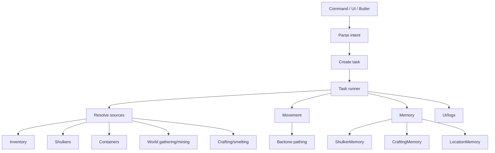
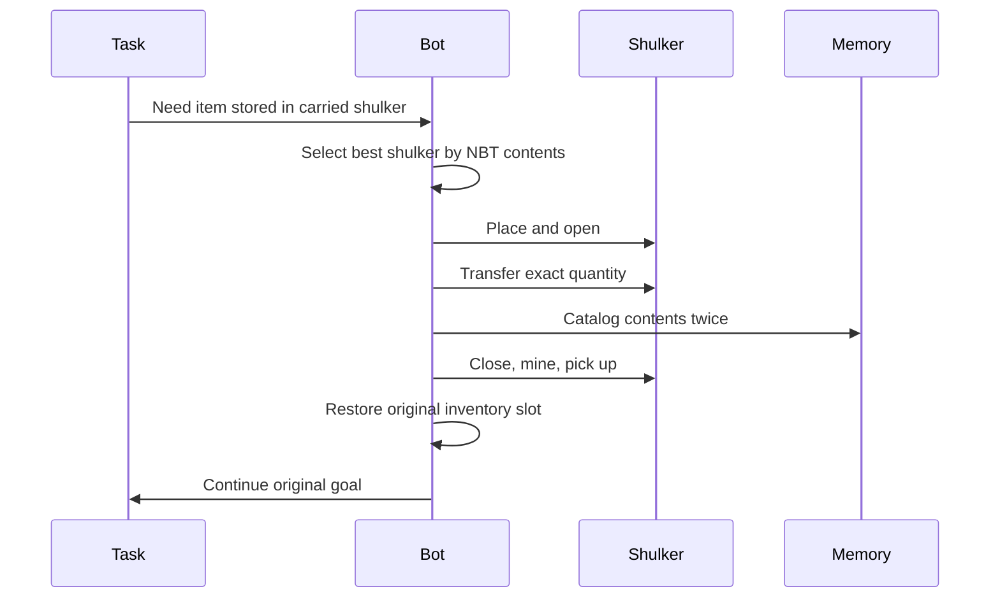

# Belfegor whitepaper

## Abstract

Belfegor is a Fabric client-side Minecraft automation agent for Minecraft `1.21.4`. It combines command parsing, task decomposition, Baritone movement, resource collection, crafting state machines, shulker-box sub-inventory management, persistent memory, an in-game UI, and optional Butler remote control to let a player issue high-level goals such as `@get diamond_shovel`, `@stacked`, `@shulker retrieve stick 8`, or `@player`.

Belfegor is intended as an experimental, practical automation bot: strong enough to be useful and fun, honest enough to expose its limitations, and instrumented enough that failures can be debugged.

## Design philosophy

Belfegor is built around four ideas:

1. **High-level commands should become task trees.** A user should not need to script every click.
2. **Inventory actions must be treated as transactions.** Most catastrophic bot bugs come from interrupted slot operations.
3. **Storage should include shulkers and memory, not just the visible inventory.**
4. **The bot should explain itself through UI and logs.** A silent stuck bot is nearly impossible to improve.

## Core capabilities

| Capability | Current state |
|---|---|
| Command system | Implemented with `@` prefix, help metadata, examples, chaining, UI command page. |
| Resource gathering | Implemented for many catalogued items. |
| Crafting | Implemented for inventory and crafting table recipes with cursor recovery. |
| Smelting | Supported through furnace/smoker/blast-furnace tasks. |
| Movement | Uses Baritone-style pathing wrappers. |
| Containers | Can store/retrieve from nearby/known containers. |
| Shulkers | Places, opens, transfers, catalogs, breaks, picks up, and remembers carried shulkers. |
| Auto shulker sorting | Timer/detection modes for eligible non-tool items. |
| PvP prep | `@stacked`, `@toolset`, and advanced PvP tasking exist. |
| Autonomous play | `@player` explores, gathers, crafts, manages shulkers, and builds a basic home campsite. |
| Beat-the-game | Classic `@gamer` and `@marvion` routes are present. |
| Butler | Authorized players can command the bot via whispers. |
| UI | `C` opens tabs for tasks, commands, settings, shulkers, and logs. |
| Debugging | Structured log tags for task, crafting, shulker, container, and screen states. |

## What Belfegor cannot do yet

Belfegor should not be oversold. Current limits:

- It is not a full general Minecraft AI.
- It does not yet automatically craft every item in Minecraft.
- Recipe variants and tags still need stronger normalization.
- `@player` does not yet build complex bases or farms.
- It can get confused by server lag, plugins, protected regions, or anti-cheat.
- It cannot guarantee beat-the-game success in every seed.
- It does not guarantee safe behavior in hostile multiplayer.
- It does not provide stealth or ban evasion.
- It can still hit inventory edge cases, especially after unusual interruptions.

## System overview



## Inventory correctness

Inventory correctness is Belfegor's central engineering problem.

Minecraft inventory automation involves:

- client-side screen handlers;
- server-side confirmations;
- different slot layouts for player inventory, tables, chests, furnaces, and shulkers;
- cursor stack state;
- item stack merging and partial moves;
- latency and screen close/open timing;
- task interruption.

The bot therefore uses:

- cursor recovery before closing risky screens;
- force-continuation during shulker/container transactions;
- screen-open diagnostics;
- inventory snapshots in logs;
- exact transfer accounting where possible.

## Shulkers as sub-inventories

Shulkers are one of Belfegor's signature systems. The bot treats them as portable storage that can be used by crafting/resource tasks.



Shulkers are explicitly excluded from auto-storage because shulkers cannot go inside shulkers.

## `@player` and base building

`@player` is an autonomous loop, not a fixed speedrun. It:

- saves the start position as home base;
- enables home-return and home-defense settings;
- wanders/explores;
- gathers dropped valuables and food;
- hunts selected mobs;
- mines simple ore targets when tools allow;
- practices a curated list of useful crafts;
- upgrades tools;
- returns home periodically;
- builds/expands a simple campsite;
- auto-sorts into shulkers when inventory pressure is high.

The campsite currently consists of:

- square perimeter wall;
- radius starting at 4 and expanding up to 8;
- two-block wall height;
- two-wide doorway on the east side;
- crafting table at `home + (1,0,1)`;
- furnace at `home + (-1,0,1)`;
- chest at `home + (0,0,-2)`.

Future base plans include storage walls, shulker stations, farms, portal pads, bedrooms, furnace rooms, and mine entrances.

## Butler system

Butler lets trusted users command the bot through whispers. This turns Belfegor into a remote helper.

Use cases:

- a teammate asks for materials;
- the bot follows a player;
- a trusted player queries inventory;
- a base owner directs shulker logistics;
- a server test operator controls a bot account remotely.

Risk: if whitelist mode is off, the current authorization fallback accepts everyone not blacklisted. On multiplayer, enable whitelist mode before relying on Butler.

## Servers and anarchy environments

Belfegor can technically run while connected to multiplayer servers, but permission and server behavior matter.

Recommended:

- singleplayer;
- private servers;
- bot test worlds;
- servers where automation is explicitly allowed.

Riskier:

- public SMPs with anti-bot rules;
- servers with strict anti-cheat;
- servers with custom inventory or chat plugins;
- anarchy servers with lag, traps, griefing, and hostile players.

Anarchy servers may tolerate automation culturally, but they are not stable test beds. Belfegor is not designed to bypass anti-cheat or conceal itself.

## Fun things users should try

Safe/fun experiments:

```text
@get crafting_table
@get diamond_shovel
@toolset stone
@toolset iron
@stacked
@shulker store [diamond 3, stick 16]
@shulker retrieve stick 8
@shulker auto run
@player
```

Project-style experiments:

- create a flat test world and watch `@player` build its first campsite;
- put supplies in a shulker and run `@get` recipes that need those supplies;
- test how it recovers from missing ingredients;
- use `@stacked` as a stress test for multi-item planning;
- use the `C` UI command page as an interactive command manual;
- inspect `belfegor_debug.log` after complex tasks and follow the task chain.

## Current pitfalls

| Area | Pitfall | Direction |
|---|---|---|
| Recipe variants | Some recipes still require exact items where Minecraft allows alternatives. | Ingredient groups/tags. |
| Task scheduling | Competing urgent tasks can oscillate. | Better force rules and scheduler diagnostics. |
| Shulker identity | NBT/slot/content matching can be imperfect. | Stronger fingerprints and labels. |
| Server compatibility | Plugins/lag/anti-cheat can break assumptions. | More defensive timing and diagnostics. |
| `@player` | Still a simple loop, not a human-level planner. | Scoring, semantic memory, modular base plans. |
| Full catalogue | Recipe registry exists, but is not yet the main planner for all items. | Automated craftable-item dependency graph. |

## Future: automate all craftable items

The long-term catalogue vision is a bot that can:

1. load every craftable item from recipe data;
2. normalize ingredient alternatives;
3. build a dependency graph;
4. determine what is craftable now;
5. gather missing prerequisites;
6. craft one or more of every possible item;
7. store outputs in base storage or shulkers;
8. log successes, failures, and blocked items;
9. learn faster routes over time.

Potential commands:

```text
@catalog recipes
@catalog craftable
@catalog missing
@collect_all_craftable
@collect_all_craftable overworld_only
@collect_all_craftable store_shulkers
```

## Conclusion

Belfegor is a practical automation agent with a strong foundation: command-driven tasks, resource collection, crafting, shulkers, memory, UI, and logs. Its future is broader and more ambitious: full craftable-item automation, persistent base operations, richer autonomous play, and better self-debugging.

It is already fun to experiment with. It is not yet magic. That honesty is part of the design.
